# Borne Admin — Musée des Transmissions

**Document de conception détaillé — V1**

| | |
|---|---|
| **Produit** | Application web d'administration du contenu d'une borne interactive |
| **Commanditaire** | Musée des Transmissions |
| **Équipe** | 3 développeurs |
| **Durée** | 4 semaines (1 mois) |
| **Statut** | Conception validée pour développement |
| **Date** | 30 juillet 2026 |

---

## Principe directeur

Chaque décision de ce document a été passée au filtre d'une seule question :

> **« Est-ce la solution la plus simple, robuste et maintenable pour une équipe de 3 développeurs en 1 mois ? »**

Quand la réponse était non, l'option a été rejetée et la raison du rejet est écrite noir sur blanc (§21). Ce document assume donc explicitement des **non-choix** : pas de CMS générique, pas de constructeur de page libre, pas de gestion de versions multi-branches, pas de multi-langue en V1. Moins de fonctionnalités, mais chacune terminée.

---

## Sommaire

1. [Vision produit](#1-vision-produit)
2. [Analyse des besoins](#2-analyse-des-besoins)
3. [Personas](#3-personas)
4. [Parcours utilisateur](#4-parcours-utilisateur)
5. [Wireframes textuels](#5-wireframes-textuels)
6. [Design System](#6-design-system)
7. [Architecture complète](#7-architecture-complète)
8. [Diagrammes d'architecture](#8-diagrammes-darchitecture)
9. [Schéma de base de données](#9-schéma-de-base-de-données)
10. [Structure des dossiers](#10-structure-des-dossiers)
11. [Description des API](#11-description-des-api)
12. [Description des composants UI](#12-description-des-composants-ui)
13. [Workflow d'administration](#13-workflow-dadministration)
14. [Workflow d'affichage sur la borne](#14-workflow-daffichage-sur-la-borne)
15. [Gestion des médias](#15-gestion-des-médias)
16. [Gestion des erreurs](#16-gestion-des-erreurs)
17. [Sécurité](#17-sécurité)
18. [Performances](#18-performances)
19. [Plan de tests](#19-plan-de-tests)
20. [Planning détaillé sur un mois](#20-planning-détaillé-sur-un-mois)
21. [Choix techniques justifiés](#21-choix-techniques-justifiés)
22. [Évolutions possibles (V2)](#22-évolutions-possibles-v2)

---

# 1. Vision produit

## 1.1 Énoncé

> **Permettre à un employé du musée, sans aucune compétence technique et sans formation préalable, de modifier le contenu affiché sur la borne d'exposition en moins de cinq minutes, sans jamais pouvoir casser la mise en page ni interrompre l'affichage public.**

## 1.2 Ce que le produit est

Un **outil de publication contraint**. L'utilisateur ne compose pas une page : il **remplit une page** dont la structure est déjà décidée par le design. Trois modèles de mise en page couvrent l'intégralité des besoins éditoriaux du musée ; chacun expose un petit nombre d'emplacements (*slots*) typés — un titre, un texte, une image, une galerie, une vidéo. L'utilisateur clique dans un emplacement et le remplit. Il ne peut rien déplacer, rien redimensionner, rien styler.

Cette contrainte est la **fonctionnalité principale**, pas une limitation. Elle garantit :

- qu'une page est **toujours** graphiquement cohérente avec les autres ;
- qu'un employé ne peut pas produire un résultat illisible sur un écran 65" ;
- que le nombre de cas d'affichage à tester reste fini (3 modèles × N emplacements) ;
- que le code de rendu de la borne est petit, lisible et stable.

## 1.3 Ce que le produit n'est pas

| Ce n'est pas… | Pourquoi |
|---|---|
| Un CMS générique (WordPress, Strapi, Directus) | Surface fonctionnelle 20× trop large, sécurité et maintenance à charge, et rien n'empêche l'utilisateur de casser la mise en page. |
| Un constructeur de page libre (Elementor, Webflow) | Demande une culture graphique ; contredit frontalement l'objectif « impossible de casser la mise en page ». |
| Un éditeur de texte riche complet | Le gras, l'italique et les listes suffisent. Un éditeur WYSIWYG complet réintroduit du HTML arbitraire, donc des ruptures de gabarit et une faille XSS. |
| Un outil multi-borne / multi-musée | Une borne, un musée. Prévu comme évolution V2 (§22), pas payé en complexité aujourd'hui. |

## 1.4 Critères de succès mesurables

Ces critères sont ceux de la recette de fin de projet (§19.6, §20 S4).

| # | Critère | Mesure | Cible V1 |
|---|---|---|---|
| C1 | Autonomie sans formation | Un employé n'ayant jamais vu l'outil crée et publie une page complète, sans aide, sans documentation | **< 10 min**, 4 employés sur 5 |
| C2 | Modification rapide | Corriger une faute dans un texte déjà publié, de la connexion à la publication | **< 2 min** |
| C3 | Aucune casse de mise en page | Tentatives délibérées de « casser » une page (texte de 5000 signes, image 1 px, vidéo 4K verticale) | **0 rendu dégradé** sur la borne |
| C4 | Disponibilité de la borne | La borne affiche du contenu même serveur d'administration éteint | **100 %** |
| C5 | Délai de prise en compte | Entre « Publier » et l'affichage sur la borne | **< 60 s** (réseau présent) |
| C6 | Réversibilité | Revenir à la version précédente d'une page | **< 30 s**, sans intervention technique |

## 1.5 Périmètre V1 (engagement)

**Inclus** — création / modification / suppression / organisation / publication de pages ; 3 modèles ; texte, images, vidéos ; bibliothèque de médias avec optimisation automatique des images ; aperçu fidèle avant publication ; 2 rôles ; sauvegardes automatiques ; synchronisation vers la borne avec fonctionnement hors-ligne garanti.

**Exclu, assumé, listé en V2 (§22)** — multi-langue, planification de publication à une date, statistiques de consultation, éditeur de modèles, workflow de validation à plusieurs niveaux, gestion de plusieurs bornes, recherche plein texte côté borne.

---

# 2. Analyse des besoins

## 2.1 Contexte d'usage réel

Deux environnements très différents, et c'est la contrainte structurante du projet.

| | **Administration** | **Borne** |
|---|---|---|
| Lieu | Bureau du musée | Salle d'exposition |
| Matériel | PC/portable bureautique, souris + clavier | Écran tactile grand format, aucun clavier |
| Utilisateur | 2 à 5 employés du musée | Grand public, enfants, scolaires, seniors |
| Session | 5 à 30 min, quelques fois par mois | 30 s à 5 min, en continu 7 j/7 |
| Réseau | Réseau du musée | **Doit fonctionner sans réseau** |
| Tolérance à la panne | Une erreur est corrigeable | Une page blanche devant le public est inacceptable |

**Conséquence n°1 :** la borne ne doit **jamais** dépendre du serveur d'administration au moment de l'affichage. Elle travaille sur une copie locale complète du contenu. Le réseau ne sert qu'à *rafraîchir* cette copie.

**Conséquence n°2 :** l'administration et la borne sont deux interfaces aux règles ergonomiques opposées (souris/clavier vs tactile ; densité d'information vs lisibilité à 2 m). Ce sont deux applications distinctes, qui partagent le modèle de contenu et les composants de rendu, mais pas l'interface.

## 2.2 Besoins fonctionnels

Notation : **M** = *Must* (V1, non négociable), **S** = *Should* (V1 si le planning tient), **C** = *Could* (V2).

### Gestion des pages

| Id | Besoin | Prio | Note |
|---|---|---|---|
| F01 | Créer une page en choisissant un des 3 modèles | M | Choix du modèle **irréversible** après création → confirmation explicite, aperçu du modèle avant choix |
| F02 | Modifier le contenu d'une page | M | Sauvegarde automatique du brouillon |
| F03 | Supprimer une page | M | Suppression **douce** : corbeille, restauration 30 j |
| F04 | Réorganiser l'ordre des pages | M | Glisser-déposer dans la liste ; l'ordre = l'ordre d'apparition sur la borne |
| F05 | Publier / dépublier une page | M | Une page dépubliée disparaît de la borne, son contenu est conservé |
| F06 | Dupliquer une page | S | Raccourci fort pour l'utilisateur : « je refais la même chose avec d'autres photos » |
| F07 | Voir l'historique et restaurer une version | S | Limité aux 20 dernières versions publiées |
| F08 | Rechercher une page par titre | S | Utile dès ~30 pages |

### Contenu d'une page

| Id | Besoin | Prio | Note |
|---|---|---|---|
| F10 | Saisir du texte dans un emplacement | M | Édition en place (clic sur le bloc dans l'aperçu) |
| F11 | Mettre en gras / italique, faire une liste | M | Uniquement ces 3 marquages, via barre d'outils |
| F12 | Placer une image par glisser-déposer | M | Depuis l'ordinateur **ou** depuis la bibliothèque |
| F13 | Placer une vidéo | M | Idem |
| F14 | Remplacer un média | M | Un bouton « Remplacer » sur le média, pas une suppression + un ajout |
| F15 | Supprimer un média d'un emplacement | M | Le média reste dans la bibliothèque |
| F16 | Recadrer / choisir le point focal d'une image | S | Un seul réglage : le point d'intérêt, pour un recadrage automatique sans tête coupée |
| F17 | Compter les signes restants dans un texte | M | Limite dure par emplacement, affichée en permanence |

### Médias

| Id | Besoin | Prio | Note |
|---|---|---|---|
| F20 | Téléverser un ou plusieurs fichiers par glisser-déposer | M | Barre de progression, reprise sur erreur |
| F21 | Optimisation automatique des images | M | Redimension + conversion + déclinaisons ; transparent pour l'utilisateur |
| F22 | Prévisualiser un média | M | Grande vignette, lecture vidéo dans le navigateur |
| F23 | Supprimer un média | M | **Refusé si le média est utilisé** : la liste des pages concernées est affichée |
| F24 | Voir où un média est utilisé | M | Corollaire indispensable de F23 |
| F25 | Renommer / légender un média | S | La légende sert de texte alternatif (accessibilité) |

### Administration

| Id | Besoin | Prio | Note |
|---|---|---|---|
| F30 | Tableau de bord | M | État de la borne, pages en brouillon, dernières modifications |
| F31 | Aperçu fidèle avant publication | M | Rendu au format exact de la borne, à l'échelle |
| F32 | Connexion par identifiant / mot de passe | M | 2 rôles : Administrateur, Éditeur |
| F33 | Paramètres généraux | M | Titre de la borne, délai de veille, page d'accueil, coordonnées |
| F34 | Journal des actions | S | Qui a publié quoi, quand |
| F35 | Sauvegarde / restauration | M | Export d'archive téléchargeable + sauvegarde automatique quotidienne |
| F36 | Voir l'état de synchronisation de la borne | M | « Borne à jour il y a 3 min » / « Borne injoignable depuis 2 h » |

## 2.3 Besoins non fonctionnels

| Id | Exigence | Cible mesurable | Vérification |
|---|---|---|---|
| N01 | La borne fonctionne sans réseau | Contenu complet en cache local, y compris médias | Test : câble débranché, redémarrage, tout s'affiche (§19.5) |
| N02 | Aucune interruption de l'affichage lors d'une publication | Bascule atomique de version | Test de publication pendant consultation |
| N03 | Temps de réponse de l'admin | < 200 ms pour toute action hors téléversement | Mesure au log serveur |
| N04 | Ouverture d'une page sur la borne | < 300 ms (contenu local) | Mesure `performance.now()` |
| N05 | Téléversement d'une image 12 Mpx | Traitée et disponible < 5 s | Test de charge léger |
| N06 | Accessibilité de l'admin | RGAA/WCAG 2.1 niveau AA sur les parcours principaux | Audit manuel + axe DevTools |
| N07 | Aucune perte de saisie | Brouillon sauvegardé ≤ 2 s après la dernière frappe | Test : fermeture brutale de l'onglet |
| N08 | Code typé de bout en bout | TypeScript `strict`, 0 `any` non justifié | CI |
| N09 | Traçabilité | Toute écriture journalisée (qui, quoi, quand) | Revue du journal |
| N10 | Reprise après panne serveur | Redémarrage automatique, données intactes | Test : `kill -9` en pleine écriture |

## 2.4 Contraintes

- **Délai :** 4 semaines calendaires, 3 développeurs. C'est la contrainte dominante ; elle justifie à elle seule la majorité des rejets technologiques du §21.
- **Équipe de maintenance après livraison :** non garantie. Le code doit être lisible par un développeur qui découvre le projet, et l'exploitation doit être possible sans compétence système (une sauvegarde = un fichier à copier).
- **Matériel de la borne :** écran tactile grand format, PC dédié en mode kiosque, pas de garantie de réseau permanent.
- **Contenu historique :** ton sobre, exactitude factuelle sous la responsabilité du musée. L'outil ne doit **jamais** générer ou compléter du contenu automatiquement.

## 2.5 Hypothèses à valider avec le musée (semaine 1)

Ces points sont bloquants au-delà de la semaine 1 ; ils sont inscrits au planning (§20) comme jalon J1.

| H1 | Volume cible : ~30 pages, ~300 médias, vidéos < 200 Mo. |
| H2 | Résolution et orientation exactes de l'écran de la borne (hypothèse de travail : 1920×1080 paysage). |
| H3 | Le réseau du musée relie le bureau à la borne (à défaut : procédure clé USB, prévue §14.5). |
| H4 | Nombre d'utilisateurs et rôles réellement souhaités (hypothèse : 5 utilisateurs, 2 rôles). |
| H5 | Politique de sauvegarde du musée (destination des archives : NAS ? disque externe ?). |

---

# 3. Personas

Trois personas suffisent : l'utilisatrice principale, l'utilisateur occasionnel anxieux, et le responsable. Le visiteur de la borne est décrit à part car il n'utilise pas l'admin.

## 3.1 Persona 1 — Sylvie, chargée de médiation culturelle *(utilisatrice principale, 80 % des usages)*

| | |
|---|---|
| **Âge / profil** | 47 ans, formation en histoire, 12 ans au musée |
| **Compétences numériques** | Word, Excel, messagerie, réseaux sociaux du musée. A déjà mis à jour un site avec « un truc compliqué » et en garde un mauvais souvenir |
| **Fréquence d'usage** | 2 à 4 fois par mois, par sessions de 20 min |
| **Contexte** | Bureau partagé, souvent interrompue |

**Ce qu'elle veut faire :** mettre en ligne une page sur une exposition temporaire avec 5 photos, corriger une date erronée signalée par un visiteur, remplacer une vidéo par une version mieux montée.

**Ses objectifs :** que ce soit fait vite et bien ; que le résultat ait l'air professionnel sans qu'elle ait à s'occuper du graphisme.

**Ses frustrations :**
- « Je ne sais jamais si c'est enregistré. »
- « J'ai peur de casser quelque chose et que ça se voie dans l'expo. »
- « On me demande une taille d'image, je ne sais pas ce que c'est. »

**Ce que le produit lui doit :**
- un indicateur d'enregistrement permanent et explicite (« Brouillon enregistré à 14 h 32 ») ;
- une séparation nette et rassurante entre *brouillon* et *publié* — tant qu'elle n'a pas cliqué sur « Publier », rien n'est visible dans l'exposition, et l'interface le lui rappelle ;
- **zéro question technique** : pas de dimension, pas de format, pas de poids. Elle dépose la photo de son appareil, le système s'occupe du reste (§15).

## 3.2 Persona 2 — Marc, agent d'accueil *(utilisateur occasionnel, à convaincre)*

| | |
|---|---|
| **Âge / profil** | 58 ans, agent d'accueil et de surveillance |
| **Compétences numériques** | Faibles et assumées. Utilise la billetterie, rien d'autre |
| **Fréquence d'usage** | 3 à 4 fois par an |
| **Contexte** | Debout, entre deux groupes ; toujours pressé |

**Ce qu'il veut faire :** une seule chose, en général urgente — dépublier une page qui contient une erreur signalée, ou corriger un horaire.

**Ses frustrations :** « À chaque fois j'ai oublié comment on fait. » Il n'a aucune mémoire de l'interface d'une fois sur l'autre.

**Ce que le produit lui doit :**
- une page d'accueil (tableau de bord) qui répond immédiatement à « qu'est-ce que je peux faire ici ? », avec 3 actions maximum mises en avant ;
- des libellés en langage métier, jamais technique : « Retirer de la borne », pas « Dépublier » ; « Photos et vidéos », pas « Médias » ;
- **aucune action destructrice atteignable par erreur** : suppression toujours en deux temps, et toujours réversible.

> Marc est le persona de référence pour l'ergonomie. **Si Marc y arrive sans aide au bout de 4 mois sans usage, l'interface est réussie.**

## 3.3 Persona 3 — Hélène, responsable des collections *(rôle Administrateur)*

| | |
|---|---|
| **Âge / profil** | 52 ans, responsable scientifique, valide les contenus |
| **Compétences numériques** | Bonnes. Rigoureuse sur l'exactitude historique |
| **Fréquence d'usage** | 1 à 2 fois par mois |

**Ce qu'elle veut faire :** relire avant publication, savoir qui a modifié quoi, gérer les comptes, s'assurer que rien n'est perdu.

**Ce que le produit lui doit :**
- un **aperçu strictement fidèle** à ce que verra le visiteur (§13.4) ;
- un **journal des actions** lisible (§16.5) ;
- la certitude que les sauvegardes existent et sont restaurables (§17.7) ;
- la possibilité de **revenir en arrière** sur une page publiée (F07).

## 3.4 Utilisateur final — le visiteur *(n'utilise pas l'admin)*

| | |
|---|---|
| **Profil** | Grand public : familles, scolaires (8-16 ans), anciens militaires, seniors |
| **Contexte** | Debout devant un écran tactile, dans le bruit, 30 s à 5 min |
| **Contraintes** | Lecture à 1,5–2 m ; certains visiteurs en fauteuil ; aucune notice, aucun clavier |

**Implications de conception, propagées jusque dans les contraintes de saisie de l'admin :**
- corps de texte ≥ 24 px sur la borne → les limites de signes par emplacement (§9.4) en découlent directement ;
- toute cible tactile ≥ 48×48 px ;
- aucune information au survol ;
- retour visuel immédiat à chaque appui ;
- retour automatique à l'accueil après inactivité (paramétrable, défaut 3 min).

---

# 4. Parcours utilisateur

## 4.1 Parcours A — Créer et publier une page *(Sylvie, parcours nominal)*

Objectif : **≤ 10 minutes, ≤ 12 clics jusqu'au premier contenu saisi.**

| # | Étape | Écran | Ce que fait l'utilisateur | Ce que fait le système |
|---|---|---|---|---|
| 1 | Connexion | `/connexion` | Identifiant + mot de passe | Session ouverte 8 h ; redirection tableau de bord |
| 2 | Départ | Tableau de bord | Clic sur **« Créer une page »** (bouton primaire, toujours au même endroit) | Ouvre le choix du modèle |
| 3 | Choix du modèle | Modale plein écran | Voit 3 grandes vignettes animées, choisit | Explique en une phrase à quoi sert chaque modèle |
| 4 | Confirmation | Modale | Saisit le titre de la page, valide | Crée la page en **brouillon**, ouvre l'éditeur |
| 5 | Saisie du titre | Éditeur | Clique sur le titre dans l'aperçu, tape | Enregistrement auto après 800 ms d'inactivité |
| 6 | Image principale | Éditeur | Glisse une photo depuis son bureau | Téléverse, optimise, affiche ; barre de progression |
| 7 | Texte | Éditeur | Clique dans le bloc texte, rédige | Compteur de signes ; alerte douce à 90 % de la limite |
| 8 | Galerie | Éditeur | Glisse 4 photos d'un coup | Traite en parallèle, remplit la galerie dans l'ordre de dépôt |
| 9 | Vérification | Éditeur → **Aperçu** | Clic sur « Aperçu » | Rendu à l'échelle exacte de la borne |
| 10 | Publication | Aperçu | Clic sur **« Publier sur la borne »** | Récapitulatif : « Cette page sera visible par les visiteurs. » → confirmation |
| 11 | Confirmation | Bandeau de succès | — | « Publié. La borne se mettra à jour d'ici une minute. » + lien « Voir l'état de la borne » |

**Points de vigilance intégrés au design :**
- étape 3 : le choix du modèle est irréversible → l'interface le dit *avant* le choix, pas après ;
- étape 6 : si l'image est ratée (trop petite, illisible), le message est en langage naturel — « Cette photo est trop petite pour un grand écran, elle apparaîtra floue. La garder quand même ? » ;
- étape 10 : c'est la seule action de tout l'outil qui a un effet public. Elle a donc un traitement visuel unique (§6.7).

## 4.2 Parcours B — Corriger une faute sur une page publiée *(objectif : < 2 min)*

1. Connexion → tableau de bord.
2. La page concernée est visible dans **« Modifiées récemment »** → clic direct. *(À défaut : Pages → recherche par titre.)*
3. L'éditeur s'ouvre. Un bandeau indique : **« Cette page est en ligne sur la borne. Vos modifications ne seront visibles qu'après publication. »**
4. Correction du texte → enregistrement auto du brouillon.
5. Clic sur **« Publier les modifications »**. Le bouton affiche le nombre de changements en attente.
6. Confirmation, fin.

**Règle de conception clé :** modifier une page publiée crée un **brouillon distinct**. La version en ligne reste intacte tant qu'on n'a pas publié. Sylvie peut donc travailler sereinement sur une page visible en exposition — c'est ce qui répond directement à sa frustration n°2 (§3.1).

## 4.3 Parcours C — Retirer une page en urgence *(Marc, < 60 s)*

1. Connexion.
2. Le tableau de bord affiche la liste des pages en ligne avec, pour chacune, un bouton **« Retirer de la borne »**.
3. Clic. Confirmation en une phrase : *« La page "…" ne sera plus visible par les visiteurs. Vous pourrez la remettre à tout moment. »*
4. Fait. Bandeau : *« Retirée. La borne se mettra à jour d'ici une minute. »*

Aucune navigation, aucun menu, aucun vocabulaire technique. **Ce parcours est la raison d'être du tableau de bord.**

## 4.4 Parcours D — Remplacer une vidéo *(Sylvie)*

1. Pages → la page concernée → éditeur.
2. Survol/appui sur la vidéo → 3 actions apparaissent : **Remplacer**, **Légender**, **Retirer**.
3. « Remplacer » → glisser le nouveau fichier ou choisir dans la bibliothèque.
4. Le système contrôle le format ; si non lisible sur la borne, il refuse **avec la marche à suivre** (§15.6), jamais avec un code d'erreur.
5. Une image de couverture est extraite automatiquement (première seconde) ; l'utilisateur peut en choisir une autre parmi 4 propositions.
6. Publier.

## 4.5 Parcours E — Réorganiser l'ordre des pages

1. Pages → vue **liste** (par défaut) ou **grille**.
2. Glisser une ligne vers le haut ou le bas. L'ordre est celui de la borne, indiqué en tête de colonne : *« Ordre d'affichage sur la borne »*.
3. Enregistrement immédiat, message discret : *« Ordre enregistré »* + **Annuler** pendant 10 s.
4. Alternative clavier obligatoire (accessibilité N06) : bouton « Monter » / « Descendre » sur chaque ligne, ou raccourci `Alt+↑` / `Alt+↓`.

## 4.6 Parcours F — Le visiteur sur la borne

1. La borne est en **veille** : page d'accueil animée, appel à l'action (« Touchez l'écran »).
2. Appui → sommaire des pages publiées, dans l'ordre défini au parcours E.
3. Appui sur une page → affichage plein écran selon le modèle.
4. Navigation : **Précédent / Suivant**, retour au sommaire, appui sur une image pour l'agrandir, lecture vidéo au doigt.
5. Après 3 min sans interaction (paramétrable) → retour automatique à la veille.

## 4.7 Cartographie des points de friction et réponses apportées

| Friction anticipée | Réponse de conception | Où |
|---|---|---|
| « Est-ce que c'est enregistré ? » | Indicateur d'état permanent + horodatage | §12.4 |
| « Est-ce que c'est visible par le public ? » | Pastille d'état sur chaque page + bandeau dans l'éditeur | §6.6 |
| « Quelle taille doit faire ma photo ? » | Question jamais posée : traitement automatique | §15.3 |
| « J'ai supprimé par erreur » | Corbeille 30 j + annulation immédiate 10 s | §13.6 |
| « Je ne retrouve plus ma page » | Recherche + tri par date de modification + « Modifiées récemment » | §12.3 |
| « La borne n'affiche pas mes changements » | État de synchronisation explicite sur le tableau de bord | §14.4 |

---

# 5. Wireframes textuels

Notation : `[Bouton]`, `[[Bouton primaire]]`, `( )` case à cocher, `▾` menu, `⋮` menu contextuel, `▓` zone média, `···` texte.

## 5.1 Connexion

```
┌──────────────────────────────────────────────────────────────┐
│                                                              │
│                    ◈  Musée des Transmissions                │
│                       Gestion de la borne                    │
│                                                              │
│              ┌────────────────────────────────┐              │
│              │  Identifiant                   │              │
│              │  ┌──────────────────────────┐  │              │
│              │  │ s.martin                 │  │              │
│              │  └──────────────────────────┘  │              │
│              │  Mot de passe                  │              │
│              │  ┌──────────────────────────┐  │              │
│              │  │ ••••••••••            👁 │  │              │
│              │  └──────────────────────────┘  │              │
│              │                                │              │
│              │      [[    Se connecter    ]]  │              │
│              │                                │              │
│              │  Mot de passe oublié ?         │              │
│              │  Contactez Hélène Dubois       │              │
│              └────────────────────────────────┘              │
│                                                              │
│                       Version 1.0.0                          │
└──────────────────────────────────────────────────────────────┘
```

- Écran volontairement nu : une seule action possible.
- Pas de « Créer un compte » (comptes créés par l'Administrateur, §17.2).
- Pas de réinitialisation par courriel en V1 : le musée est une petite structure, la procédure humaine est plus simple et plus sûre qu'un service d'envoi de courriels à maintenir. Le nom affiché vient des paramètres (F33).

## 5.2 Tableau de bord

```
┌──────────────────────────────────────────────────────────────────────────────┐
│ ◈ Borne du musée   Tableau de bord  Pages  Photos et vidéos  Paramètres   SM │
├──────────────────────────────────────────────────────────────────────────────┤
│                                                                              │
│  Bonjour Sylvie                                    [[ + Créer une page ]]    │
│                                                                              │
│  ┌────────────────────────────────────────────────────────────────────────┐  │
│  │ ● La borne est à jour                          Dernier contact : 14:31 │  │
│  │   12 pages en ligne · 3 brouillons              [ Voir la borne ]      │  │
│  └────────────────────────────────────────────────────────────────────────┘  │
│                                                                              │
│  Modifiées récemment                                                         │
│  ┌────────────────────────────────────────────────────────────────────────┐  │
│  │ ▓  Les pigeons voyageurs        Brouillon    modifiée il y a 5 min  ⋮  │  │
│  │ ▓  Le poste ER-56               ● En ligne   modifiée hier          ⋮  │  │
│  │ ▓  Exposition temporaire 2026   ● En ligne   modifiée le 12/07      ⋮  │  │
│  └────────────────────────────────────────────────────────────────────────┘  │
│                                     Voir toutes les pages →                  │
│                                                                              │
│  ┌─────────────────────────┐  ┌─────────────────────────┐                    │
│  │ 3 brouillons à finir    │  │ Espace disque           │                    │
│  │ [ Les reprendre ]       │  │ 2,4 Go utilisés sur 50  │                    │
│  └─────────────────────────┘  └─────────────────────────┘                    │
└──────────────────────────────────────────────────────────────────────────────┘
```

**Décisions :**
- Le bandeau d'état de la borne est **en haut, toujours**. C'est la question n°1 de tous les utilisateurs.
- « Photos et vidéos » et non « Médias » (persona Marc, §3.2).
- Le menu `⋮` de chaque ligne contient **Retirer de la borne** : le parcours C (§4.3) est atteignable en 2 clics depuis l'accueil.
- Aucun graphique décoratif : rien qui ne serve à une décision.

## 5.3 Liste des pages

```
┌──────────────────────────────────────────────────────────────────────────────┐
│ Pages                                              [[ + Créer une page ]]    │
│                                                                              │
│ ┌────────────────────┐  État : Toutes ▾                    ⊞ Grille  ☰ Liste │
│ │ 🔍 Rechercher      │                                                       │
│ └────────────────────┘                                                       │
│                                                                              │
│  Ordre d'affichage sur la borne — glissez pour réorganiser                   │
│ ┌──────────────────────────────────────────────────────────────────────────┐ │
│ │ ⠿ 1  ▓  Accueil de l'exposition     Modèle 1  ● En ligne   12/07     ⋮  │ │
│ │ ⠿ 2  ▓  Les origines (1875)         Modèle 2  ● En ligne   12/07     ⋮  │ │
│ │ ⠿ 3  ▓  Le poste ER-56              Modèle 2  ● En ligne   hier      ⋮  │ │
│ │ ⠿ 4  ▓  Film : la transmission…     Modèle 3  ● En ligne   03/07     ⋮  │ │
│ │ ⠿ 5  ▓  Les pigeons voyageurs       Modèle 1  ○ Brouillon  il y a 5m ⋮  │ │
│ └──────────────────────────────────────────────────────────────────────────┘ │
│                                                                              │
│  Corbeille (2)                                                               │
└──────────────────────────────────────────────────────────────────────────────┘
```

- La poignée `⠿` n'apparaît qu'au survol/focus, mais l'ordre numéroté est **toujours** visible : l'utilisateur comprend le concept avant même d'interagir.
- Les brouillons restent dans la liste ordonnée, en grisé, avec la mention « n'apparaît pas encore sur la borne ».
- Menu `⋮` : Modifier · Aperçu · Dupliquer · Retirer de la borne / Mettre en ligne · Historique · Supprimer.

## 5.4 Choix du modèle (création)

```
┌──────────────────────────────────────────────────────────────────────────────┐
│  Quel type de page voulez-vous créer ?                                  [✕]  │
│                                                                              │
│  ┌────────────────────┐  ┌────────────────────┐  ┌────────────────────┐      │
│  │ ┌────────────────┐ │  │ ┌──────┐┌────────┐ │  │ ┌────────────────┐ │      │
│  │ │  TITRE         │ │  │ │      ││ ······ │ │  │ │      ▶         │ │      │
│  │ ├────────────────┤ │  │ │  ▓   ││ ······ │ │  │ │   ·········    │ │      │
│  │ │       ▓        │ │  │ └──────┘└────────┘ │  │ │   [ Encart ]   │ │      │
│  │ ├────────────────┤ │  │ ┌──┐┌──┐┌──┐┌──┐   │  │ └────────────────┘ │      │
│  │ │ ············   │ │  │ │▓ ││▓ ││▓ ││▓ │   │  │                    │      │
│  │ └────────────────┘ │  │ └──┘└──┘└──┘└──┘   │  │                    │      │
│  │                    │  │                    │  │                    │      │
│  │ Une image,         │  │ Comparer une image │  │ Mettre en avant    │      │
│  │ un texte           │  │ et un texte        │  │ une vidéo          │      │
│  │                    │  │                    │  │                    │      │
│  │ Idéal pour         │  │ Idéal pour décrire │  │ Idéal pour un film │      │
│  │ présenter un objet │  │ un objet en détail │  │ ou un témoignage.  │      │
│  │ ou introduire un   │  │ avec des photos    │  │                    │      │
│  │ thème.             │  │ complémentaires.   │  │                    │      │
│  │                    │  │                    │  │                    │      │
│  │   [ Choisir ]      │  │   [ Choisir ]      │  │   [ Choisir ]      │      │
│  └────────────────────┘  └────────────────────┘  └────────────────────┘      │
│                                                                              │
│  ℹ Le modèle ne pourra plus être changé ensuite. Vous pourrez toujours       │
│    créer une nouvelle page si vous changez d'avis.                           │
└──────────────────────────────────────────────────────────────────────────────┘
```

- Les vignettes sont des **rendus réels réduits** des composants de modèle, pas des dessins : elles ne peuvent pas mentir (§7.5).
- Chaque modèle est décrit par **son usage** (« Idéal pour… »), pas par sa structure technique.
- L'irréversibilité est annoncée **avant** le choix, et immédiatement dédramatisée.

## 5.5 Éditeur de contenu (écran central du produit)

```
┌──────────────────────────────────────────────────────────────────────────────┐
│ ← Pages   Les pigeons voyageurs            ✓ Brouillon enregistré à 14:32    │
│                                        [ Aperçu ]  [[ Publier sur la borne ]]│
├───────────────────────────────────────────────────────────┬──────────────────┤
│                                                           │ BLOC SÉLECTIONNÉ │
│  ┌─────────────────────────────────────────────────────┐  │                  │
│  │                                                     │  │  Texte           │
│  │   Les pigeons voyageurs                    ✎        │  │  ┌────────────┐  │
│  │   ───────────────────────────────                   │  │  │  G  I  ≡   │  │
│  │                                                     │  │  └────────────┘  │
│  │  ┌───────────────────────────────────────────────┐  │  │                  │
│  │  │                                               │  │  │  412 / 900       │
│  │  │              ▓  IMAGE PRINCIPALE              │  │  │  signes          │
│  │  │                                               │  │  │                  │
│  │  │     [ Remplacer ]  [ Légender ]  [ Retirer ]  │  │  │  ─────────────   │
│  │  └───────────────────────────────────────────────┘  │  │                  │
│  │                                                     │  │  Conseil         │
│  │   Dès 1870, l'armée française utilise le pigeon     │  │  Un texte court  │
│  │   voyageur comme moyen de transmission… ✎           │  │  se lit mieux    │
│  │                                                     │  │  de loin.        │
│  └─────────────────────────────────────────────────────┘  │                  │
│                                                           │                  │
│         Aperçu à l'échelle — 1920 × 1080                  │                  │
└───────────────────────────────────────────────────────────┴──────────────────┘
```

**Décisions structurantes :**

1. **L'éditeur est l'aperçu.** Pas de formulaire à gauche et de rendu à droite : on édite directement dans une miniature fidèle de l'écran de la borne. C'est le principe « ce que vous voyez est ce que verra le visiteur », et il supprime à lui seul la moitié des questions d'un utilisateur non technique.
2. **Le panneau de droite est contextuel** : il ne montre que les réglages du bloc sélectionné. Quand rien n'est sélectionné, il affiche les informations de la page (titre, modèle, état).
3. **Les emplacements vides sont explicites**, jamais des zones blanches :
   ```
   ┌───────────────────────────────────────────────┐
   │            ⬆  Glissez une photo ici           │
   │       ou   [ Choisir dans la bibliothèque ]   │
   └───────────────────────────────────────────────┘
   ```
4. **Aucune poignée de redimensionnement, aucune marge réglable, aucun sélecteur de couleur.** Il n'y a rien à casser parce qu'il n'y a rien à régler.
5. Le bouton **Publier** est le seul bouton plein de l'écran (§6.7).

## 5.6 Bibliothèque de médias

```
┌──────────────────────────────────────────────────────────────────────────────┐
│ Photos et vidéos                                    [[ + Ajouter ]]          │
│                                                                              │
│ [🔍 Rechercher]   Type : Tout ▾   Tri : Plus récent ▾   ( ) Non utilisés     │
│                                                                              │
│  ┌────────────────────────────────────────────────────────────────────────┐  │
│  │       ⬆  Glissez vos photos et vidéos ici pour les ajouter             │  │
│  └────────────────────────────────────────────────────────────────────────┘  │
│                                                                              │
│  ┌────────┐ ┌────────┐ ┌────────┐ ┌────────┐ ┌────────┐ ┌────────┐           │
│  │   ▓    │ │   ▓    │ │  ▶ ▓   │ │   ▓    │ │   ▓    │ │   ▓    │           │
│  │        │ │        │ │  2:14  │ │        │ │        │ │        │           │
│  ├────────┤ ├────────┤ ├────────┤ ├────────┤ ├────────┤ ├────────┤           │
│  │pigeon… │ │ER56_01 │ │film_tr…│ │atelier │ │affiche │ │ salle  │           │
│  │ 2 pages│ │ 1 page │ │ 1 page │ │ ⚠ 0 pg │ │ 1 page │ │ ⚠ 0 pg │           │
│  └────────┘ └────────┘ └────────┘ └────────┘ └────────┘ └────────┘           │
│                                                                              │
│                          ⟳ Envoi : IMG_4471.jpg  ████████░░ 78 %             │
└──────────────────────────────────────────────────────────────────────────────┘
```

- **Le nombre de pages utilisant chaque média est affiché sous la vignette.** C'est ce qui rend la suppression compréhensible (F23/F24) et permet le ménage (« Non utilisés »).
- Panneau de détail au clic : grande prévisualisation, légende éditable, dimensions, poids **après** optimisation, liste des pages utilisatrices (liens cliquables), boutons **Remplacer partout** et **Supprimer**.

## 5.7 Aperçu avant publication

```
┌──────────────────────────────────────────────────────────────────────────────┐
│ ← Retour à l'édition        APERÇU                          [[ Publier ]]    │
├──────────────────────────────────────────────────────────────────────────────┤
│                                                                              │
│        ┌────────────────────────────────────────────────────────┐            │
│        │                                                        │            │
│        │              (rendu exact 1920 × 1080,                 │            │
│        │               réduit à l'échelle,                      │            │
│        │               interactif : on peut cliquer)            │            │
│        │                                                        │            │
│        └────────────────────────────────────────────────────────┘            │
│                                                                              │
│   ✓ Titre renseigné    ✓ Image principale    ⚠ Aucune légende sur l'image    │
│                                                                              │
│   ℹ Vous voyez exactement ce que verront les visiteurs.                      │
└──────────────────────────────────────────────────────────────────────────────┘
```

- La liste de contrôle sous l'aperçu distingue **bloquant** (✗ rouge, empêche la publication) et **conseillé** (⚠ orange, n'empêche rien). Voir §13.5.
- L'aperçu est **interactif** : on peut ouvrir la galerie, lancer la vidéo. C'est le seul moyen de vérifier vraiment.

## 5.8 Paramètres

```
┌──────────────────────────────────────────────────────────────────────────────┐
│ Paramètres                                                                   │
│                                                                              │
│  Borne                                                                       │
│  ┌────────────────────────────────────────────────────────────────────────┐  │
│  │ Titre affiché en veille   [ Musée des Transmissions              ]     │  │
│  │ Page d'accueil            [ Accueil de l'exposition           ▾ ]      │  │
│  │ Retour à l'accueil après  [ 3 ▾ ] minutes sans interaction            │  │
│  └────────────────────────────────────────────────────────────────────────┘  │
│                                                                              │
│  Sauvegardes                                                                 │
│  ┌────────────────────────────────────────────────────────────────────────┐  │
│  │ Dernière sauvegarde automatique : aujourd'hui à 03:00  ✓               │  │
│  │ [ Télécharger une sauvegarde ]   [ Restaurer une sauvegarde ]          │  │
│  └────────────────────────────────────────────────────────────────────────┘  │
│                                                                              │
│  Utilisateurs                                        (Administrateur seul)   │
│  ┌────────────────────────────────────────────────────────────────────────┐  │
│  │ Sylvie Martin      Éditeur          dernière connexion : aujourd'hui ⋮ │  │
│  │ Marc Petit         Éditeur          il y a 3 mois                    ⋮ │  │
│  │ Hélène Dubois      Administrateur   hier                             ⋮ │  │
│  │                                              [ + Ajouter un compte ]   │  │
│  └────────────────────────────────────────────────────────────────────────┘  │
│                                                                              │
│  Journal des actions                                 (Administrateur seul)   │
│  ┌────────────────────────────────────────────────────────────────────────┐  │
│  │ 14:31  Sylvie Martin a mis en ligne « Le poste ER-56 »                 │  │
│  │ 14:02  Sylvie Martin a ajouté 4 photos                                 │  │
│  │ hier   Hélène Dubois a retiré « Ancienne expo » de la borne            │  │
│  └────────────────────────────────────────────────────────────────────────┘  │
└──────────────────────────────────────────────────────────────────────────────┘
```

Les sections réservées à l'Administrateur ne sont **pas affichées en grisé** pour un Éditeur : elles sont absentes. Montrer une porte fermée n'aide personne.

## 5.9 Borne — veille, sommaire, page

```
VEILLE                                  SOMMAIRE
┌────────────────────────────┐          ┌────────────────────────────┐
│                            │          │  Musée des Transmissions   │
│      ▓ image d'accueil     │          │ ┌──────┐ ┌──────┐ ┌──────┐ │
│                            │          │ │  ▓   │ │  ▓   │ │  ▓   │ │
│   MUSÉE DES TRANSMISSIONS  │          │ │Titre │ │Titre │ │Titre │ │
│                            │          │ └──────┘ └──────┘ └──────┘ │
│      ◉ Touchez l'écran     │          │ ┌──────┐ ┌──────┐ ┌──────┐ │
│                            │          │ │  ▓   │ │  ▓   │ │  ▓   │ │
└────────────────────────────┘          │ └──────┘ └──────┘ └──────┘ │
                                        └────────────────────────────┘

PAGE (modèle 2)
┌──────────────────────────────────────────────────────────────┐
│  ‹ Sommaire                                    Page 3 sur 12 │
│  ┌──────────────────┐   Le poste ER-56                       │
│  │                  │   ────────────────────                 │
│  │        ▓         │   Mis en service en 1956, le poste     │
│  │                  │   ER-56 équipe les unités…             │
│  └──────────────────┘                                        │
│  ┌────┐ ┌────┐ ┌────┐ ┌────┐                                 │
│  │ ▓  │ │ ▓  │ │ ▓  │ │ ▓  │  ← galerie, appui = plein écran │
│  └────┘ └────┘ └────┘ └────┘                                 │
│                                                              │
│  ‹ Précédent                                     Suivant ›   │
└──────────────────────────────────────────────────────────────┘
```

Cibles tactiles ≥ 48 px, navigation toujours aux mêmes endroits (retour en haut à gauche, précédent/suivant en bas), aucune information au survol.

---

# 6. Design System

Objectif : **un système minimal mais complet**, écrit une fois en variables CSS, utilisé par les deux applications. Ni bibliothèque de composants tierce, ni framework CSS (justification §21.6).

## 6.1 Principes

1. **Sobriété institutionnelle.** Le contenu du musée est le sujet ; l'interface doit disparaître. Aucune couleur décorative, aucune ombre gratuite, aucune animation qui ne communique pas un changement d'état.
2. **Une seule couleur d'accent.** Elle signale « ce sur quoi on peut agir » et rien d'autre.
3. **Hiérarchie par l'espace et la taille**, pas par la couleur ni les bordures.
4. **États systématiques.** Tout composant interactif définit ses 6 états : repos, survol, focus clavier, actif, désactivé, chargement. Un composant sans focus visible est un bug (N06).
5. **Deux échelles typographiques distinctes** : l'admin se lit à 50 cm, la borne à 2 m. Ce sont deux systèmes, pas un système redimensionné.

## 6.2 Couleurs

```css
/* packages/ui/tokens.css — source unique de vérité */
:root {
  /* Neutres — ossature de l'interface */
  --c-fond:            #FBFBFD;   /* fond d'application */
  --c-surface:         #FFFFFF;   /* cartes, panneaux */
  --c-surface-2:       #F4F5F7;   /* zones en retrait, en-têtes de tableau */
  --c-bordure:         #E3E5E9;   /* séparateurs */
  --c-bordure-forte:   #C7CAD1;   /* contours de champs */
  --c-texte:           #14171F;   /* principal — contraste 15,8:1 */
  --c-texte-doux:      #5A6072;   /* secondaire — 6,4:1 */
  --c-texte-faible:    #858B9A;   /* légendes — 4,6:1, jamais sous 14 px */

  /* Accent — bleu institutionnel, unique couleur d'action */
  --c-accent:          #1B5FA8;
  --c-accent-fort:     #164E8B;   /* survol / actif */
  --c-accent-doux:     #EAF1F9;   /* fond de sélection */
  --c-accent-contour:  #A9C6E6;

  /* États sémantiques */
  --c-succes:          #1B7F4B;   --c-succes-doux:  #E8F5EE;
  --c-alerte:          #9A6206;   --c-alerte-doux:  #FDF4E3;
  --c-erreur:          #B3261E;   --c-erreur-doux:  #FDECEA;
  --c-en-ligne:        #1B7F4B;   /* pastille « en ligne » */
  --c-brouillon:       #858B9A;   /* pastille « brouillon » */
}
```

**Règles de contraste (AA obligatoire, N06) :** texte ≥ 4,5:1 ; texte large (≥ 24 px, ou ≥ 19 px gras) ≥ 3:1 ; contour d'élément interactif ≥ 3:1. Les valeurs ci-dessus sont vérifiées ; **toute nouvelle couleur doit l'être avant intégration.**

**Règle absolue :** aucune information n'est portée par la couleur seule. Une page en ligne porte une pastille verte **et** le mot « En ligne ». Un champ en erreur a une bordure rouge **et** une icône **et** un message.

## 6.3 Typographie

Deux familles, auto-hébergées en `woff2` — aucune ressource distante (contrainte hors-ligne de la borne, et confidentialité côté admin).

```css
:root {
  --f-titre:  "Source Serif 4", Georgia, serif;   /* titres : ton musée */
  --f-texte:  "Inter", system-ui, "Segoe UI", sans-serif;
}
```

**Échelle admin** (base 16 px, rapport 1,25) :

| Rôle | Taille / interligne | Graisse | Famille |
|---|---|---|---|
| Titre de page | 30 / 38 px | 600 | titre |
| Section | 22 / 30 px | 600 | titre |
| Sous-section | 18 / 26 px | 600 | texte |
| Corps | 15 / 24 px | 400 | texte |
| Secondaire | 14 / 20 px | 400 | texte |
| Légende, méta | 13 / 18 px | 500 | texte |
| Bouton | 15 / 20 px | 550 | texte |

**Échelle borne** (base 24 px — lecture à 2 m) :

| Rôle | Taille / interligne | Graisse |
|---|---|---|
| Titre de page | 68 / 78 px | 600 |
| Sous-titre | 40 / 50 px | 500 |
| Corps | 26 / 40 px | 400 |
| Légende de média | 20 / 28 px | 500 |
| Bouton de navigation | 24 / 32 px | 600 |

**Règles :** longueur de ligne 55–75 signes (admin) / 45–60 (borne) ; jamais de texte justifié ; jamais de capitales sur plus de 3 mots ; l'utilisateur ne choisit **aucune** de ces valeurs.

## 6.4 Espacement, rayons, élévation, mouvement

```css
:root {
  /* Espacement — base 4 px, une seule échelle */
  --e-1: 4px;   --e-2: 8px;   --e-3: 12px;  --e-4: 16px;
  --e-5: 24px;  --e-6: 32px;  --e-7: 48px;  --e-8: 64px;

  /* Rayons */
  --r-s: 6px;   --r-m: 10px;  --r-l: 16px;  --r-rond: 999px;

  /* Élévation — 3 niveaux, pas plus */
  --o-1: 0 1px 2px rgb(20 23 31 / .06), 0 1px 3px rgb(20 23 31 / .04);
  --o-2: 0 4px 12px rgb(20 23 31 / .08), 0 1px 3px rgb(20 23 31 / .06);
  --o-3: 0 16px 40px rgb(20 23 31 / .16);

  /* Mouvement */
  --t-rapide: 120ms cubic-bezier(.2,0,.2,1);   /* survol, focus */
  --t-normal: 200ms cubic-bezier(.2,0,.2,1);   /* apparition de panneau */
  --t-lent:   320ms cubic-bezier(.2,0,0,1);    /* modale, transition d'écran */

  /* Cible tactile minimale (borne) */
  --cible-min: 48px;
}

@media (prefers-reduced-motion: reduce) {
  * { animation-duration: 1ms !important; transition-duration: 1ms !important; }
}
```

## 6.5 Composants de base (inventaire figé)

Le design system V1 contient **exactement** ces composants. Toute demande supplémentaire passe par un arbitrage de planning.

| Composant | Variantes | Notes |
|---|---|---|
| `Bouton` | primaire, secondaire, discret, danger · tailles M/L · état chargement | **Un seul bouton primaire visible par écran** |
| `Champ` | texte, mot de passe, nombre, zone de texte | libellé au-dessus, aide en dessous, erreur sous l'aide |
| `Selecteur` | — | `<select>` natif : accessible et robuste par défaut |
| `Bascule` | — | réglages booléens des paramètres |
| `Pastille` | en ligne, brouillon, corbeille, erreur | point coloré **+ libellé** |
| `Carte` | simple, cliquable | conteneur de base |
| `Modale` | S / M / plein écran | focus piégé, `Échap`, clic extérieur, restitution du focus |
| `Bandeau` | info, succès, alerte, erreur | contextuel, dans le flux |
| `Notification` | succès, erreur, avec action « Annuler » | bas-gauche, 6 s, empilable |
| `MenuContextuel` | — | navigation clavier complète |
| `ZoneDepot` | image, vidéo, tout | 3 états : repos, survol de fichier, dépôt refusé |
| `Squelette` | ligne, carte, vignette | pour les chargements > 300 ms |
| `EtatVide` | — | icône + phrase + **action** ; jamais une zone vide |
| `Confirmation` | normale, destructive | destructive = bouton danger + conséquence écrite en clair |

## 6.6 Grammaire visuelle des états de publication

C'est le concept que l'utilisateur doit intégrer en premier ; il est donc représenté **partout de la même façon**.

| État | Représentation | Signification écrite |
|---|---|---|
| **Brouillon** | `○ Brouillon` gris | « N'apparaît pas sur la borne » |
| **En ligne** | `● En ligne` vert | « Visible par les visiteurs » |
| **En ligne, modifiée** | `● En ligne · ✎ 3 modifications non publiées` | « Les visiteurs voient encore l'ancienne version » |
| **Retirée** | `○ Retirée` gris | « Retirée de la borne, contenu conservé » |
| **Corbeille** | `🗑 Corbeille` | « Supprimée le 12/07 — restaurable jusqu'au 11/08 » |

## 6.7 Traitement singulier de l'action « Publier »

**Publier** est la seule action de l'outil qui a un effet visible par le public. Elle bénéficie donc d'un traitement unique, non réutilisable ailleurs :

- position fixe, en haut à droite, sur tous les écrans d'édition ;
- seul bouton plein d'accent de l'écran ;
- libellé dynamique : « Publier sur la borne » (première fois) / « Publier les modifications (3) » ;
- confirmation systématique, formulée en **conséquence pour le visiteur**, jamais en termes techniques ;
- retour immédiat et explicite après action, avec l'état de propagation vers la borne.

## 6.8 Rédaction de l'interface

Le vocabulaire fait partie du design system. Il est figé dans un lexique partagé.

| Ne pas écrire | Écrire |
|---|---|
| Média, asset | Photo, vidéo |
| Dépublier | **Retirer de la borne** |
| Slug, identifiant, métadonnée | *(ne jamais montrer)* |
| Erreur 413 : payload too large | « Cette vidéo dépasse 200 Mo. Voici comment la réduire. » |
| Upload en cours | « Envoi en cours… » |
| Confirmer la suppression ? | « Supprimer "Les pigeons voyageurs" ? Vous pourrez la récupérer dans la corbeille pendant 30 jours. » |
| Champ requis | « Il manque le titre de la page. » |

**Règles :** vouvoiement ; phrases courtes ; un message d'erreur dit toujours **ce qui s'est passé** *et* **quoi faire maintenant** ; aucun code technique visible par l'utilisateur — il est journalisé côté serveur avec un identifiant d'incident que l'utilisateur peut communiquer au support.

## 6.9 Accessibilité — exigences non négociables

- Navigation clavier complète, ordre de tabulation logique, contour de focus visible (2 px accent + 2 px décalage) — **jamais** `outline: none` sans remplacement.
- Le glisser-déposer a **toujours** une alternative clavier et bouton (réordonnancement F04, dépôt de média F12).
- `<label>` explicites ; `aria-live="polite"` pour l'état d'enregistrement, `aria-live="assertive"` pour les erreurs.
- Structure de titres `h1 → h2 → h3` sans saut.
- Toutes les images de contenu ont une alternative textuelle : **la légende saisie par l'utilisateur sert d'alternative** (§15.5) — l'accessibilité devient automatique, sans formulaire supplémentaire.
- Zoom navigateur 200 % sans perte de fonction.
- Côté borne : cibles ≥ 48 px, contrastes renforcés (≥ 7:1 sur les textes principaux), aucune interaction dépendant du survol, mode « position basse » pour les visiteurs en fauteuil (bascule des commandes vers le bas de l'écran).

---

# 7. Architecture complète

## 7.1 La décision structurante : la borne ne dépend jamais du réseau

Tout le reste de l'architecture découle de cette contrainte (N01, C4). Trois options ont été étudiées :

| Option | Principe | Verdict |
|---|---|---|
| **A. La borne interroge l'API en direct** | Le navigateur de la borne appelle l'API à chaque page | **Rejetée.** Une coupure réseau = écran vide devant le public. Inacceptable. |
| **B. Borne = application web + *service worker*** | Le navigateur met en cache l'application et les médias | **Rejetée.** Le stockage navigateur est soumis à un quota et à l'éviction automatique ; avec des vidéos de 200 Mo, le risque de perte silencieuse est réel, et le diagnostic est difficile pour un non-spécialiste. |
| **C. Agent local de synchronisation** ✅ | Un petit service Node sur le PC de la borne télécharge le contenu publié sur le disque local et le sert sur `localhost` | **Retenue.** |

**Pourquoi C.** L'agent est un programme d'environ 200 lignes qui fait trois choses : demander périodiquement à l'API s'il existe une publication plus récente, télécharger ce qui manque dans un dossier temporaire, puis basculer atomiquement le dossier courant. Le navigateur de la borne ne parle **qu'à `localhost`**. Conséquences :

- réseau coupé, serveur éteint, panne d'API : la borne continue d'afficher la dernière publication complète — **par construction**, pas par précaution ;
- le contenu est constitué de fichiers visibles dans un dossier : un employé ou un technicien peut vérifier l'état de la borne en ouvrant l'explorateur de fichiers, sans outil de développement ;
- aucun quota, aucune éviction, aucun comportement dépendant du navigateur ;
- la bascule est atomique (renommage de dossier), donc **jamais de publication à moitié appliquée** (N02).

C'est plus de code que l'option B (un fichier de plus à écrire), mais **beaucoup moins de risque** — et le risque, ici, c'est un écran noir dans une salle d'exposition.

## 7.2 Vue d'ensemble

Quatre exécutables, un dépôt.

| Composant | Rôle | Tourne sur | Techno |
|---|---|---|---|
| **`api`** | Cœur métier : pages, médias, publications, comptes. Sert aussi les fichiers de l'admin | Serveur du musée (mini-PC ou VM) | Node + Fastify |
| **`admin`** | Interface d'administration | Navigateur des employés | React SPA |
| **`borne-agent`** | Synchronisation + serveur local de la borne | PC de la borne | Node |
| **`borne`** | Interface tactile de consultation | Navigateur en mode kiosque de la borne | React SPA |

Et deux bibliothèques partagées, qui sont la clé de la cohérence du produit :

| Paquet | Contenu | Utilisé par |
|---|---|---|
| **`contenu`** | Schémas Zod du modèle de contenu, types TypeScript dérivés, **composants React des 3 modèles**, rendu du texte enrichi | `api`, `admin`, `borne` |
| **`ui`** | Design system : variables CSS, composants de base | `admin` |

> **Le paquet `contenu` est ce qui garantit que l'aperçu de l'administration est identique à l'affichage de la borne** : ce n'est pas une ressemblance, c'est le même composant React, alimenté par les mêmes données, validé par le même schéma. Il n'existe aucun chemin de code où les deux pourraient diverger. C'est la réponse d'architecture au besoin F31.

## 7.3 Architecture serveur (`api`)

### 7.3.1 Découpage en couches (Clean Architecture, version proportionnée)

Quatre couches, une règle de dépendance : **les flèches ne pointent que vers l'intérieur**.

```
interface/http     ─┐  Fastify : routes, schémas d'entrée, conversion des erreurs
                    │  Ne contient AUCUNE règle métier.
application        ─┤  Cas d'usage, un fichier par cas (PublierPage, TeleverserMedia…)
                    │  Orchestration + transaction. Dépend des ports, jamais de SQLite.
domaine            ─┤  Entités, règles, invariants, ports (interfaces).
                    │  Zéro import externe hormis Zod. Testable sans rien démarrer.
infrastructure     ─┘  Implémentations : SQLite/Kysely, disque, sharp, argon2, pino.
```

**Proportionnalité assumée.** On ne fait *pas* de Clean Architecture dogmatique : pas de couche d'objets de transfert entre application et interface (les schémas Zod partagés jouent ce rôle), pas d'injection de dépendances par conteneur (une simple fonction `construireApplication()` assemble tout à la racine). L'objectif n'est pas la pureté : c'est que **la logique métier soit testable sans base de données et remplaçable sans réécriture**.

### 7.3.2 Ce que contient chaque couche

**`domaine/`** — le seul endroit où vivent les règles :

```ts
// domaine/page/page.ts
export type EtatPage = 'brouillon' | 'en_ligne' | 'retiree' | 'supprimee'

export interface Page {
  readonly id: PageId
  readonly modele: IdModele            // 't1' | 't2' | 't3' — immuable après création
  readonly titre: string
  readonly etat: EtatPage
  readonly ordre: number
  readonly contenuBrouillon: ContenuPage
  readonly contenuPublie: ContenuPage | null
  readonly modifieeLe: Date
}

/** Règle métier : une page ne peut être mise en ligne que si son contenu
 *  satisfait les exigences bloquantes de son modèle (§13.5). */
export function peutEtreMiseEnLigne(page: Page): Resultat<void, ProblemeContenu[]> { … }

/** Règle métier : le modèle est immuable — il n'existe aucune fonction pour le changer. */
```

L'immuabilité du modèle n'est pas garantie par une vérification : elle est garantie par **l'absence de code capable de le modifier**. C'est la forme la plus robuste d'invariant.

**`application/`** — un fichier par cas d'usage, signature uniforme :

```ts
// application/pages/publier-page.ts
export async function publierPage(
  deps: { pages: DepotPages; publications: DepotPublications; journal: Journal },
  cmd: { pageId: PageId; parUtilisateur: UtilisateurId },
): Promise<Resultat<{ version: number }, ErreurApplicative>> { … }
```

Aucun `import` de Fastify, aucun `import` de Kysely. Ces fonctions se testent en mémoire (§19.2).

**`infrastructure/`** — les *adaptateurs* : `SqlitePages implements DepotPages`, `DisqueMedias implements StockageMedias`, `SharpImages implements ProcesseurImages`. Chacun est remplaçable ; c'est ce qui rend l'éventuel passage à PostgreSQL ou à un stockage objet en V2 (§22) sans effet sur le métier.

**`interface/http/`** — routes Fastify. Chaque route fait exactement quatre choses : valider l'entrée (schéma Zod), vérifier le droit, appeler un cas d'usage, convertir le résultat en réponse HTTP. Une route qui contient un `if` métier est un défaut de revue de code.

### 7.3.3 Traitement des erreurs, en un seul endroit

Le domaine et l'application ne lèvent pas d'exception pour les cas prévus : ils renvoient un `Resultat<T, E>`. Seuls les cas *imprévus* (disque plein, base corrompue) lèvent. Un unique `setErrorHandler` Fastify convertit tout en réponse normalisée (§16.2). Aucune route ne contient de `try/catch`.

## 7.4 Architecture front-end (`admin`)

### 7.4.1 Découpage par fonctionnalité, pas par type de fichier

```
src/
  app/                 point d'entrée, routes, fournisseurs, gestion d'erreur globale
  fonctionnalites/
    authentification/
    tableau-de-bord/
    pages/             liste, éditeur, aperçu, historique
    medias/            bibliothèque, téléversement, sélecteur
    parametres/
  partage/             hooks, client API, utilitaires, formatage des dates
```

Un développeur qui doit corriger l'éditeur ouvre **un** dossier. Le découpage `components/ hooks/ services/` a été écarté : il éparpille chaque fonctionnalité dans quatre endroits, ce qui coûte cher dès qu'on est trois à travailler en parallèle.

### 7.4.2 Gestion de l'état — trois catégories, trois outils

| Catégorie | Exemple | Outil | Pourquoi |
|---|---|---|---|
| État **serveur** | liste des pages, médias, état de la borne | **TanStack Query** | cache, revalidation, réessais, état de chargement/erreur : supprime la majorité du code d'état écrit à la main, et les bogues qui vont avec |
| État **d'écran** | bloc sélectionné, panneau ouvert | `useState` / `useReducer` local | inutile de globaliser |
| État **de session** | utilisateur connecté, notifications | un `Context` chacun | deux contextes, pas un magasin global |

**Aucune bibliothèque d'état global (Redux, Zustand, MobX).** Une fois l'état serveur confié à TanStack Query, il ne reste presque rien à partager ; introduire un magasin global reviendrait à créer un problème pour lui apporter une solution.

### 7.4.3 Le brouillon : la mécanique la plus sensible de l'admin

Exigence N07 : aucune perte de saisie. Mécanique retenue :

1. l'éditeur détient le contenu du brouillon en état local (réactivité immédiate, zéro latence de frappe) ;
2. **800 ms** après la dernière frappe, envoi `PATCH /pages/:id/brouillon` ;
3. l'indicateur passe par trois états visibles : *Modifications en cours* → *Enregistrement…* → *Brouillon enregistré à 14:32* ;
4. en cas d'échec réseau : réessai automatique (3 tentatives, délai croissant), bandeau d'alerte, et **le contenu est écrit dans `localStorage`** ;
5. à la réouverture de l'éditeur, si `localStorage` contient une version plus récente que le serveur : proposition explicite de récupération, jamais d'écrasement silencieux ;
6. `beforeunload` bloque la fermeture d'onglet tant qu'un enregistrement est en attente.

**Verrouillage d'édition simultanée.** Deux personnes qui éditent la même page en même temps est un cas rare mais destructeur. Solution proportionnée : *verrou consultatif*. Le premier éditeur pose un verrou (15 min, prolongé par l'activité) ; le second voit *« Sylvie Martin modifie cette page en ce moment. »* et ouvre en lecture seule, avec un bouton « Prendre la main » qui prévient le premier. Ni verrouillage strict (source de blocages : quelqu'un part en congés le verrou posé), ni fusion automatique (complexité sans commune mesure avec le besoin).

## 7.5 Le modèle de contenu, cœur du produit

### 7.5.1 Principe : des emplacements typés, pas des blocs libres

Une page n'est pas une liste de blocs arbitraires. C'est **un modèle + une valeur pour chacun de ses emplacements**. Le modèle décrit, en un seul endroit, la structure autorisée :

```ts
// packages/contenu/modeles/modele-1.ts
export const modele1 = definirModele({
  id: 't1',
  nom: 'Une image, un texte',
  description: 'Idéal pour présenter un objet ou introduire un thème.',
  emplacements: {
    titre:      { type: 'titre',  requis: true,  maxSignes: 70 },
    image:      { type: 'image',  requis: true,  ratio: '16/9', largeurMin: 1280 },
    texte:      { type: 'texte',  requis: true,  maxSignes: 900 },
  },
})
```

Le schéma Zod de validation, le formulaire de l'admin, les contrôles avant publication et le composant de rendu sont **tous dérivés de cette déclaration**. Ajouter un emplacement, c'est modifier une ligne — pas quatre fichiers.

### 7.5.2 Les trois modèles

| | **Modèle 1** — Une image, un texte | **Modèle 2** — Image et texte côte à côte | **Modèle 3** — Vidéo en avant |
|---|---|---|---|
| Usage | Présenter un objet, ouvrir un thème | Décrire en détail avec des photos | Film, témoignage |
| `titre` | requis, 70 signes | requis, 70 signes | requis, 60 signes |
| `image` / `imagePrincipale` | requise, 16/9 | requise, 4/3 ou 3/4 | — |
| `video` | — | — | **requise**, 30 min max |
| `texte` | requis, 900 signes | requis, 1400 signes | requis, 400 signes (superposé) |
| `galerie` | — | facultative, 3 à 8 images | — |
| `encart` | — | — | facultatif : sous-titre 60 + texte 200 |

Les limites de signes ne sont pas arbitraires : elles découlent de la taille de police de la borne (§6.3) et de la surface disponible dans chaque zone. **C'est ce qui rend structurellement impossible le débordement de texte** (critère C3).

### 7.5.3 Texte enrichi : un sous-ensemble volontairement minuscule

Trois marquages, et rien d'autre : **gras**, *italique*, liste à puces. Stockés dans un format textuel simple (`**gras**`, `_italique_`, lignes commençant par `- `), rendus par une fonction partagée d'une quarantaine de lignes qui produit du JSX.

**Aucun HTML n'est stocké, donc aucun HTML n'est rendu.** Cela élimine par construction : l'injection de script (§17.5), les styles collés depuis Word qui cassent la charte, les tableaux et images insérés là où le modèle ne les prévoit pas. Le collage depuis Word ou un navigateur est intercepté et **converti en texte simple**, en conservant uniquement gras et italique.

Un éditeur WYSIWYG complet (TipTap, Lexical, Slate) a été écarté pour ces raisons — détail du rejet en §21.7.

## 7.6 Modèle de publication : des versions immuables

Publier ne modifie pas « la page sur la borne ». Publier crée une **publication** : un instantané complet, immuable et numéroté de l'ensemble du contenu destiné à la borne.

```
Publication n°47
├── manifeste.json      titre de la borne, réglages, liste ordonnée des pages,
│                       contenu complet de chaque page, empreinte de chaque média
└── médias référencés   (les fichiers eux-mêmes, adressés par empreinte)
```

Ce choix apporte quatre propriétés d'un coup :

1. **Atomicité** — la borne bascule d'une publication complète à une autre, jamais d'un état intermédiaire (N02).
2. **Retour arrière trivial** — republier la publication n°46 est une écriture de ligne, pas une reconstruction.
3. **Synchronisation simple** — l'agent compare un numéro de version, pas des milliers d'objets.
4. **Traçabilité** — on sait exactement ce qui était affiché le 12 juillet à 14 h (Hélène, §3.3).

Les médias sont adressés par **empreinte de leur contenu** (SHA-256, 12 premiers caractères) : `4f3a91b2c7d0.webp`. Un fichier déjà présent sur la borne n'est jamais retéléchargé, et deux publications successives ne partagent pas seulement leur nom mais leur identité. Les 20 dernières publications sont conservées, les plus anciennes purgées (avec leurs médias devenus orphelins).

## 7.7 Récapitulatif technologique

| Couche | Retenu | Raison en une ligne (détail §21) |
|---|---|---|
| Langage | **TypeScript strict** (partout) | Un seul langage, types partagés du serveur à la borne |
| Front | **React 19 + Vite** | Écosystème connu, démarrage instantané, build simple |
| Routage | **React Router** | Standard, suffisant |
| État serveur | **TanStack Query** | Supprime le code d'état écrit à la main |
| Styles | **CSS Modules + variables CSS** | Zéro dépendance, zéro configuration, lisible par tous |
| Glisser-déposer | **@dnd-kit** | Le seul accessible au clavier — exigence N06 |
| Serveur | **Node LTS + Fastify** | Validation, journalisation et gestion d'erreurs intégrées |
| Validation | **Zod** (paquet partagé) | Une seule définition pour le front, le serveur et la borne |
| Base | **SQLite + better-sqlite3 + Kysely** | Un fichier, transactionnel, sauvegarde = copie, requêtes typées |
| Migrations | **Fichiers `.sql` + exécuteur maison (~40 lignes)** | Pas d'ORM à apprendre ni à maintenir |
| Images | **sharp** | Référence du domaine, très rapide |
| Mots de passe | **argon2** | Recommandation OWASP actuelle |
| Journalisation | **pino** (intégré à Fastify) | JSON structuré, coût quasi nul |
| Tests | **Vitest** + Testing Library + `fastify.inject` | Un seul exécuteur pour tout le dépôt |
| Qualité | **Biome** (lint + format) | Un outil au lieu de deux, configuration nulle |
| Dépôt | **npm workspaces** | Intégré à npm : aucun outil de monorepo à installer |

**Aucune dépendance n'est présente « parce qu'elle est répandue ».** Chaque ligne ci-dessus répond à une exigence nommée du §2. Les technologies écartées et le motif du rejet sont au §21.

## 7.8 Stratégie de déploiement

### 7.8.1 Cible

Deux machines seulement.

```
Serveur du musée (mini-PC ou VM, 4 Go RAM, 128 Go SSD)
├── api            service système, redémarrage automatique
├── admin          fichiers statiques servis par l'api
├── donnees.db     SQLite
└── medias/        fichiers originaux et déclinaisons

PC de la borne (Windows, mode kiosque)
├── borne-agent    service au démarrage, synchronise et sert sur localhost:8080
├── borne/         application compilée
└── publication/   dossier courant + précédent (bascule atomique)
```

### 7.8.2 Livraison

- Une archive de version unique (`borne-admin-1.0.0.zip`) contenant les quatre exécutables compilés et les scripts d'installation. **Pas de conteneurisation en V1** : Docker ajoute une couche d'exploitation que le musée n'a pas les moyens de maintenir, pour un gain nul sur une machine dédiée mono-service. Le rejet est motivé en §21.10.
- Installation du serveur : Node LTS, `npm ci --omit=dev`, création du service (systemd ou NSSM sous Windows), un fichier `.env`.
- Installation de la borne : Node LTS, l'agent en service au démarrage, un raccourci navigateur en mode kiosque vers `http://localhost:8080`.
- Mise à jour : arrêt du service, remplacement des fichiers, migrations exécutées automatiquement au démarrage, redémarrage. **La base et les médias ne sont jamais touchés par une mise à jour.**

### 7.8.3 Chiffrement des échanges

Le trafic entre le navigateur des employés et l'API traverse le réseau du musée et transporte des mots de passe : il doit être chiffré. **Caddy** est placé devant l'API et fournit un certificat automatiquement (autorité interne sur réseau local, ou certificat public si le musée dispose d'un nom de domaine). Coût : un fichier de configuration de six lignes. La borne, elle, ne parle qu'à `localhost` et n'est pas concernée.

### 7.8.4 Environnements

Deux, pas trois. **Local** (chaque développeur : SQLite en fichier, médias dans un dossier temporaire, données d'exemple injectables en une commande) et **production** (le musée). Un environnement de pré-production n'apporterait rien sur un projet d'un mois où la recette se fait sur la machine réelle avec les utilisateurs réels (§20, S4).

---

# 8. Diagrammes d'architecture

## 8.1 Vue de contexte

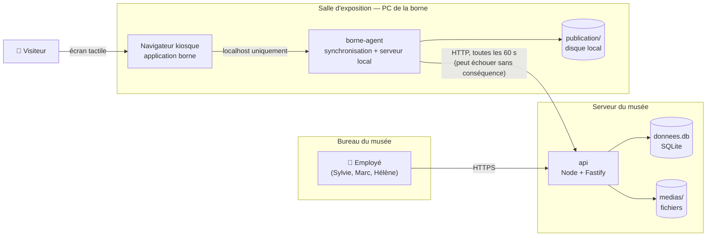

**Lecture du diagramme :** une seule flèche relie la borne au reste du système, et elle est en pointillés conceptuels — si elle disparaît, la borne continue de fonctionner sur `publication/`.

## 8.2 Composants et dépendances

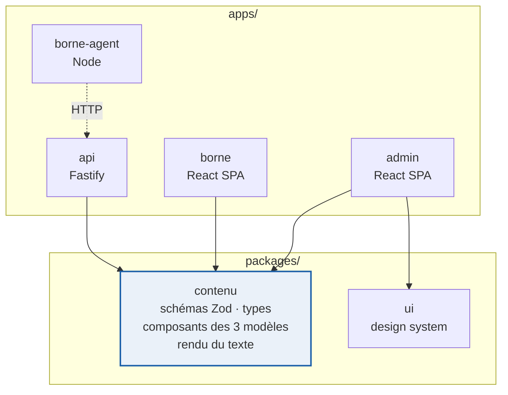

`contenu` est importé par les trois applications : **c'est ce qui rend l'aperçu structurellement fidèle** (§7.2).

## 8.3 Couches de l'API

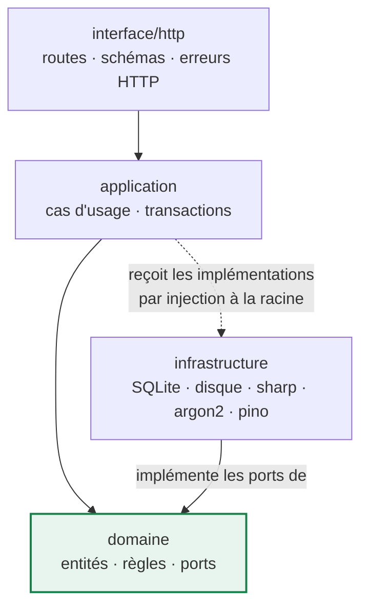

Le domaine ne connaît ni HTTP, ni SQL, ni le système de fichiers. Il se teste sans démarrer quoi que ce soit.

## 8.4 Cycle de vie d'une page

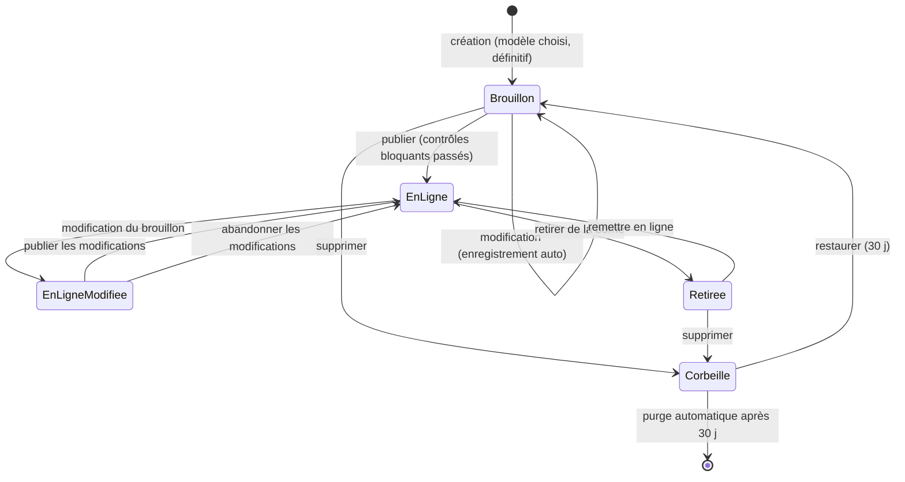

Une page **en ligne** ne peut pas aller directement à la corbeille : il faut d'abord la retirer de la borne. Ce détour d'un clic supplémentaire évite la suppression accidentelle d'un contenu visible par le public.

## 8.5 Séquence — publication et propagation vers la borne

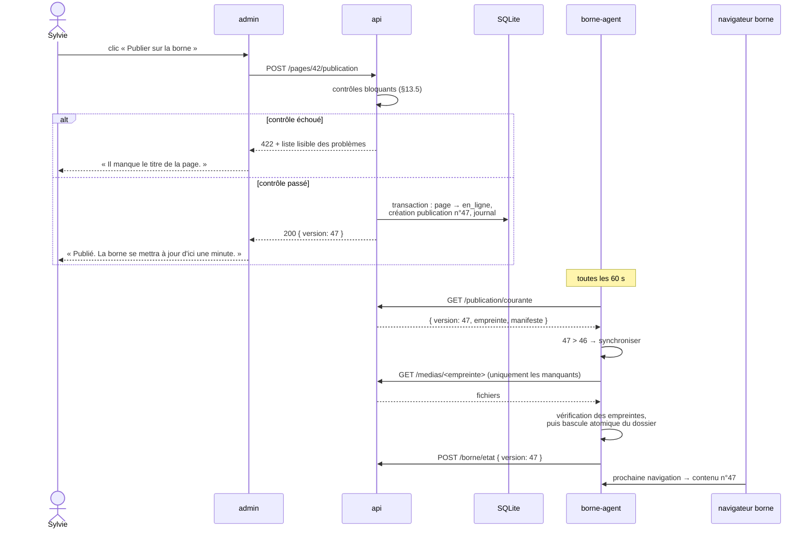

**Point essentiel :** si l'`api` est injoignable à l'étape de synchronisation, l'agent conserve la publication n°46 et réessaie. Aucune dégradation visible par le visiteur ; le tableau de bord de l'admin, lui, signale « Borne injoignable depuis 2 h » (F36).

## 8.6 Séquence — téléversement et optimisation d'une image

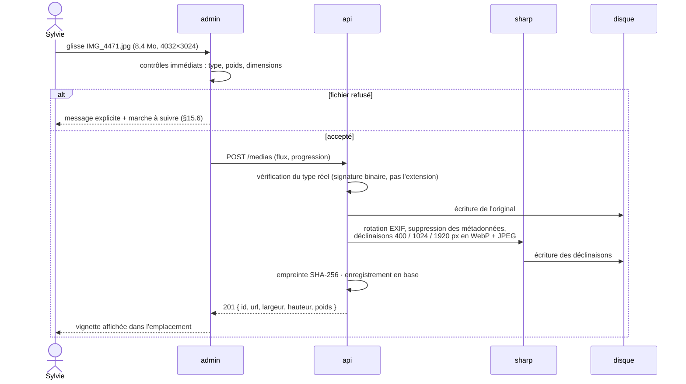

## 8.7 Flux de données du contenu

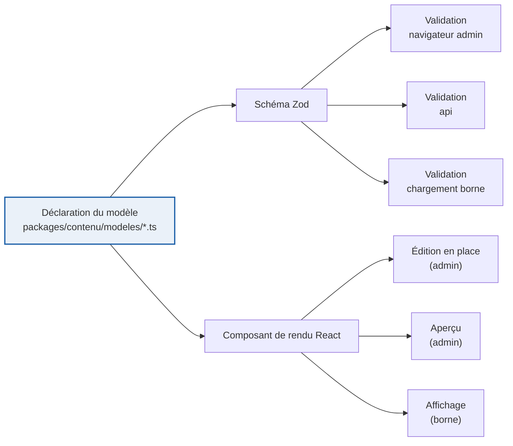

Une modification de modèle se propage mécaniquement à la validation *et* au rendu, dans les trois applications. **C'est le principe DRY appliqué là où il compte vraiment** : à la définition du contenu.

---

# 9. Schéma de base de données

## 9.1 Choix du moteur : SQLite

| Critère | SQLite | PostgreSQL / MySQL |
|---|---|---|
| Installation | Aucune (un fichier) | Serveur à installer, configurer, superviser |
| Sauvegarde | Copier un fichier | `pg_dump`, planification, restauration à documenter |
| Concurrence en écriture | Un écrivain à la fois | Élevée |
| Besoin réel du projet | 2 à 5 utilisateurs, quelques écritures par jour | — |
| Exploitation par le musée | Possible sans compétence | Nécessite un administrateur |

Le seul avantage réel de PostgreSQL — la concurrence en écriture — ne correspond à aucun besoin ici. SQLite en mode WAL absorbe sans difficulté plusieurs centaines d'écritures par seconde, soit trois ordres de grandeur au-dessus de l'usage attendu. Et **la sauvegarde qui consiste à copier un fichier est une propriété de robustesse majeure** pour une structure sans service informatique (§17.7).

Configuration au démarrage :

```sql
PRAGMA journal_mode = WAL;      -- lectures concurrentes pendant l'écriture
PRAGMA foreign_keys = ON;       -- intégrité référentielle réellement appliquée
PRAGMA synchronous = NORMAL;    -- bon compromis en WAL
PRAGMA busy_timeout = 5000;
```

## 9.2 Modèle conceptuel

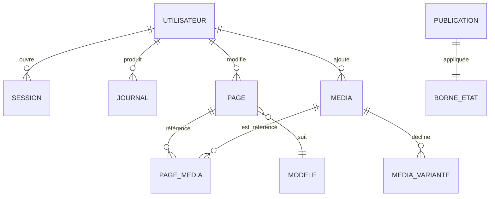

`MODELE` n'est pas une table : les trois modèles sont déclarés dans le code (§7.5.1). Les mettre en base laisserait croire qu'ils sont modifiables sans redéploiement, ce qui est faux — chaque modèle a un composant de rendu. Mieux vaut une contrainte honnête qu'une souplesse illusoire.

## 9.3 Schéma physique

```sql
-- ─────────────────────────────────────────────────────────────
-- 001_initial.sql
-- ─────────────────────────────────────────────────────────────

CREATE TABLE utilisateur (
  id                    TEXT PRIMARY KEY,              -- ULID
  identifiant           TEXT NOT NULL UNIQUE,          -- « s.martin »
  nom_affiche           TEXT NOT NULL,                 -- « Sylvie Martin »
  mot_de_passe_hash     TEXT NOT NULL,                 -- argon2id
  role                  TEXT NOT NULL CHECK (role IN ('administrateur','editeur')),
  actif                 INTEGER NOT NULL DEFAULT 1,
  cree_le               TEXT NOT NULL,                 -- ISO-8601 UTC
  derniere_connexion_le TEXT,
  echecs_connexion      INTEGER NOT NULL DEFAULT 0,
  bloque_jusqu_a        TEXT                           -- anti-force brute (§17.3)
);

CREATE TABLE session (
  id             TEXT PRIMARY KEY,
  utilisateur_id TEXT NOT NULL REFERENCES utilisateur(id) ON DELETE CASCADE,
  jeton_hash     TEXT NOT NULL UNIQUE,   -- SHA-256 du jeton ; le clair n'est jamais stocké
  cree_le        TEXT NOT NULL,
  expire_le      TEXT NOT NULL,
  adresse_ip     TEXT,
  agent          TEXT
);
CREATE INDEX idx_session_utilisateur ON session(utilisateur_id);
CREATE INDEX idx_session_expiration  ON session(expire_le);

CREATE TABLE page (
  id                 TEXT PRIMARY KEY,
  modele             TEXT NOT NULL CHECK (modele IN ('t1','t2','t3')),  -- immuable
  titre              TEXT NOT NULL,
  etat               TEXT NOT NULL CHECK (etat IN ('brouillon','en_ligne','retiree','corbeille')),
  ordre              REAL NOT NULL,          -- réel : réordonnancement sans réécrire la table
  contenu_brouillon  TEXT NOT NULL,          -- JSON validé par le schéma du modèle
  contenu_publie     TEXT,                   -- JSON, NULL tant que jamais publiée
  cree_le            TEXT NOT NULL,
  cree_par           TEXT NOT NULL REFERENCES utilisateur(id),
  modifiee_le        TEXT NOT NULL,
  modifiee_par       TEXT NOT NULL REFERENCES utilisateur(id),
  publiee_le         TEXT,
  supprimee_le       TEXT                    -- suppression douce
);
CREATE INDEX idx_page_etat  ON page(etat);
CREATE INDEX idx_page_ordre ON page(ordre) WHERE etat != 'corbeille';

CREATE TABLE page_verrou (
  page_id        TEXT PRIMARY KEY REFERENCES page(id) ON DELETE CASCADE,
  utilisateur_id TEXT NOT NULL REFERENCES utilisateur(id) ON DELETE CASCADE,
  expire_le      TEXT NOT NULL
);

CREATE TABLE media (
  id                TEXT PRIMARY KEY,
  empreinte         TEXT NOT NULL UNIQUE,   -- SHA-256 du fichier d'origine
  type              TEXT NOT NULL CHECK (type IN ('image','video')),
  mime              TEXT NOT NULL,
  nom_origine       TEXT NOT NULL,          -- « IMG_4471.jpg »
  nom_affiche       TEXT NOT NULL,          -- modifiable par l'utilisateur
  legende           TEXT,                   -- sert aussi d'alternative textuelle (§15.5)
  poids_octets      INTEGER NOT NULL,
  largeur           INTEGER,
  hauteur           INTEGER,
  duree_secondes    REAL,                   -- vidéos
  poster_media_id   TEXT REFERENCES media(id) ON DELETE SET NULL,   -- image de couverture
  point_focal_x     REAL DEFAULT 0.5,       -- recadrage automatique sans tête coupée (F16)
  point_focal_y     REAL DEFAULT 0.5,
  cree_le           TEXT NOT NULL,
  cree_par          TEXT NOT NULL REFERENCES utilisateur(id),
  supprime_le       TEXT
);
CREATE INDEX idx_media_type ON media(type) WHERE supprime_le IS NULL;

CREATE TABLE media_variante (
  media_id      TEXT NOT NULL REFERENCES media(id) ON DELETE CASCADE,
  profil        TEXT NOT NULL,   -- 'vignette' | 'moyen' | 'grand' | 'origine'
  format        TEXT NOT NULL,   -- 'webp' | 'jpeg' | 'mp4'
  largeur       INTEGER,
  hauteur       INTEGER,
  poids_octets  INTEGER NOT NULL,
  chemin        TEXT NOT NULL,   -- relatif à la racine des médias
  PRIMARY KEY (media_id, profil, format)
);

-- Index d'usage : reconstruit à chaque écriture d'une page.
-- Répond à « où ce média est-il utilisé ? » (F24) et sécurise la suppression (F23).
CREATE TABLE page_media (
  page_id     TEXT NOT NULL REFERENCES page(id) ON DELETE CASCADE,
  media_id    TEXT NOT NULL REFERENCES media(id) ON DELETE CASCADE,
  emplacement TEXT NOT NULL,
  PRIMARY KEY (page_id, media_id, emplacement)
);
CREATE INDEX idx_page_media_media ON page_media(media_id);

CREATE TABLE publication (
  version     INTEGER PRIMARY KEY AUTOINCREMENT,
  manifeste   TEXT NOT NULL,     -- JSON complet destiné à la borne (§7.6)
  empreinte   TEXT NOT NULL,     -- SHA-256 du manifeste
  cree_le     TEXT NOT NULL,
  cree_par    TEXT NOT NULL REFERENCES utilisateur(id),
  motif       TEXT               -- « Mise en ligne de : Le poste ER-56 »
);

CREATE TABLE borne_etat (
  id                  INTEGER PRIMARY KEY CHECK (id = 1),   -- ligne unique
  version_appliquee   INTEGER REFERENCES publication(version),
  dernier_contact_le  TEXT,
  version_agent       TEXT,
  message             TEXT
);

CREATE TABLE parametre (
  cle          TEXT PRIMARY KEY,
  valeur       TEXT NOT NULL,     -- JSON
  modifie_le   TEXT NOT NULL
);

CREATE TABLE journal (
  id             INTEGER PRIMARY KEY AUTOINCREMENT,
  horodatage     TEXT NOT NULL,
  utilisateur_id TEXT REFERENCES utilisateur(id),
  action         TEXT NOT NULL,   -- 'page.publiee', 'media.supprime', 'connexion.echec'…
  cible_type     TEXT,
  cible_id       TEXT,
  details        TEXT,            -- JSON
  adresse_ip     TEXT
);
CREATE INDEX idx_journal_horodatage ON journal(horodatage DESC);

CREATE TABLE migration (
  version    INTEGER PRIMARY KEY,
  applique_le TEXT NOT NULL
);
```

## 9.4 Format du contenu d'une page

Le contenu est stocké en JSON dans `page.contenu_brouillon` / `contenu_publie`, validé par le schéma Zod du modèle avant toute écriture.

```jsonc
// Exemple — page au modèle 2
{
  "modele": "t2",
  "emplacements": {
    "titre":  { "type": "titre", "valeur": "Le poste ER-56" },
    "image":  { "type": "image", "mediaId": "01J8X…", "legende": "Poste ER-56, 1956" },
    "texte":  { "type": "texte", "valeur": "Mis en service en **1956**, le poste ER-56…" },
    "galerie": {
      "type": "galerie",
      "elements": [
        { "mediaId": "01J8Y…", "legende": "Vue de face" },
        { "mediaId": "01J8Z…", "legende": "Le combiné" }
      ]
    }
  }
}
```

**Pourquoi du JSON plutôt que des tables `bloc` / `valeur_bloc` ?** Un contenu de page est toujours lu et écrit **en entier**, jamais par morceaux ; on ne fait aucune requête du type « toutes les pages dont le troisième bloc contient X ». Une modélisation relationnelle fine ajouterait cinq jointures et une complexité de mise à jour, sans aucun gain. La seule requête transversale réelle — « où ce média est-il utilisé ? » — est servie par la table `page_media`, qui est un index dérivé, reconstruit à chaque écriture dans la même transaction. C'est la solution la plus simple qui satisfait tous les besoins exprimés.

## 9.5 Historique et retour arrière

Pas de table d'historique dédiée. Chaque `publication` contient déjà l'intégralité du contenu de toutes les pages à un instant donné. L'historique d'une page est donc la suite des publications qui la contiennent, extraite par les fonctions JSON de SQLite :

```sql
SELECT version, cree_le, cree_par,
       json_extract(manifeste, '$.pages[' || :i || '].contenu') AS contenu
FROM publication
WHERE manifeste LIKE '%' || :page_id || '%'
ORDER BY version DESC LIMIT 20;
```

Restaurer une version = écrire le contenu extrait dans `contenu_brouillon`, puis publier normalement. **Une seule notion (la publication) sert l'atomicité, la synchronisation, l'historique et le retour arrière** : c'est le meilleur rapport entre valeur fonctionnelle et complexité de tout le modèle de données.

## 9.6 Réordonnancement

`page.ordre` est un **réel**, pas un entier. Déplacer une page entre celles d'ordre 3,0 et 4,0 lui donne 3,5 : une seule ligne modifiée, aucune renumérotation, aucun verrou de table. Une normalisation (1, 2, 3…) est déclenchée automatiquement si l'écart entre deux valeurs voisines devient inférieur à 0,001 — cas qui ne survient pas avant plusieurs milliers de déplacements consécutifs au même endroit.

## 9.7 Migrations

Fichiers SQL numérotés dans `apps/api/migrations/`, appliqués au démarrage dans une transaction, avec inscription dans `migration`. L'exécuteur fait une quarantaine de lignes. Pas d'ORM, pas d'outil de migration, pas de génération automatique : sur un projet d'un mois avec une dizaine de tables stables, écrire le SQL à la main est plus rapide, plus lisible et plus sûr qu'apprendre et configurer un outil.

## 9.8 Volumétrie attendue

| Table | Volume à 3 ans | Remarque |
|---|---|---|
| `page` | ~100 lignes | — |
| `media` | ~1 000 lignes | Les fichiers sont sur le disque, pas en base |
| `publication` | 20 lignes (les plus anciennes purgées) | Manifeste ~200 Ko chacun |
| `journal` | ~50 000 lignes | Purge au-delà de 2 ans |
| **Fichier `donnees.db`** | **< 100 Mo** | **Médias sur disque : 20 à 50 Go** |

---

# 10. Structure des dossiers

```
borne-admin/
├── package.json                    espaces de travail npm, scripts racine
├── biome.json                      lint + format, configuration unique
├── tsconfig.base.json              options TypeScript strictes partagées
├── README.md                       démarrage en 5 minutes
├── EXPLOITATION.md                 installation, sauvegarde, restauration, incidents
│
├── apps/
│   ├── api/
│   │   ├── src/
│   │   │   ├── domaine/                    ← aucune dépendance externe
│   │   │   │   ├── page/
│   │   │   │   │   ├── page.ts             entité + règles
│   │   │   │   │   ├── etats.ts            transitions autorisées (§8.4)
│   │   │   │   │   └── depot-pages.ts      port (interface)
│   │   │   │   ├── media/
│   │   │   │   ├── publication/
│   │   │   │   ├── utilisateur/
│   │   │   │   └── partage/
│   │   │   │       ├── resultat.ts         Resultat<T, E>
│   │   │   │       ├── identifiants.ts     ULID typés
│   │   │   │       └── erreurs.ts          taxonomie des erreurs métier
│   │   │   ├── application/                ← un fichier par cas d'usage
│   │   │   │   ├── pages/
│   │   │   │   │   ├── creer-page.ts
│   │   │   │   │   ├── enregistrer-brouillon.ts
│   │   │   │   │   ├── publier-page.ts
│   │   │   │   │   ├── retirer-page.ts
│   │   │   │   │   ├── reordonner-pages.ts
│   │   │   │   │   ├── supprimer-page.ts
│   │   │   │   │   └── restaurer-version.ts
│   │   │   │   ├── medias/
│   │   │   │   ├── publication/
│   │   │   │   ├── utilisateurs/
│   │   │   │   └── sauvegarde/
│   │   │   ├── infrastructure/             ← implémentations des ports
│   │   │   │   ├── base/
│   │   │   │   │   ├── connexion.ts        better-sqlite3 + Kysely + PRAGMA
│   │   │   │   │   ├── migrations.ts       exécuteur (~40 lignes)
│   │   │   │   │   └── depots/             SqlitePages, SqliteMedias…
│   │   │   │   ├── fichiers/               stockage disque, écriture atomique
│   │   │   │   ├── images/                 adaptateur sharp
│   │   │   │   ├── securite/               argon2, jetons, limitation de débit
│   │   │   │   └── journalisation/         pino
│   │   │   ├── interface/http/
│   │   │   │   ├── serveur.ts              construction de Fastify, greffons
│   │   │   │   ├── routes/                 auth · pages · medias · publication · borne · parametres
│   │   │   │   ├── intergiciels/           session, rôles, limitation
│   │   │   │   └── erreurs.ts              gestionnaire unique (§16.2)
│   │   │   ├── config.ts                   variables d'environnement validées par Zod
│   │   │   └── principal.ts                point d'entrée
│   │   ├── migrations/
│   │   │   └── 001_initial.sql
│   │   └── tests/
│   │       ├── domaine/                    unitaires, sans base
│   │       ├── application/                dépôts en mémoire
│   │       └── http/                       fastify.inject, base temporaire
│   │
│   ├── admin/
│   │   ├── index.html
│   │   ├── src/
│   │   │   ├── app/                        routes, fournisseurs, garde-fou d'erreur
│   │   │   ├── fonctionnalites/
│   │   │   │   ├── authentification/
│   │   │   │   ├── tableau-de-bord/
│   │   │   │   ├── pages/
│   │   │   │   │   ├── liste/
│   │   │   │   │   ├── editeur/            ← composant central
│   │   │   │   │   │   ├── Editeur.tsx
│   │   │   │   │   │   ├── ToileEdition.tsx        rendu du modèle, éditable
│   │   │   │   │   │   ├── PanneauBloc.tsx         réglages contextuels
│   │   │   │   │   │   ├── ChampTexteEnrichi.tsx
│   │   │   │   │   │   ├── EmplacementMedia.tsx
│   │   │   │   │   │   └── useBrouillon.ts         enregistrement auto (§7.4.3)
│   │   │   │   │   ├── apercu/
│   │   │   │   │   └── historique/
│   │   │   │   ├── medias/
│   │   │   │   └── parametres/
│   │   │   ├── partage/
│   │   │   │   ├── api/                    client typé, un fichier par ressource
│   │   │   │   ├── hooks/
│   │   │   │   └── formats/                dates, poids, durées — en français
│   │   │   └── principal.tsx
│   │   └── tests/
│   │
│   ├── borne/
│   │   ├── index.html
│   │   ├── src/
│   │   │   ├── App.tsx                     navigation, veille, chargement local
│   │   │   ├── ecrans/                     Veille · Sommaire · Page · Lightbox
│   │   │   ├── contenu/                    lecture du manifeste local + validation
│   │   │   └── principal.tsx
│   │   └── tests/
│   │
│   └── borne-agent/
│       ├── src/
│       │   ├── principal.ts                boucle de synchronisation
│       │   ├── synchronisation.ts          téléchargement, vérification, bascule
│       │   └── serveur-local.ts            fichiers statiques sur localhost:8080
│       └── tests/
│
├── packages/
│   ├── contenu/                            ← paquet le plus important du dépôt
│   │   ├── src/
│   │   │   ├── modeles/
│   │   │   │   ├── definir-modele.ts        fabrique + dérivation du schéma Zod
│   │   │   │   ├── modele-1.ts
│   │   │   │   ├── modele-2.ts
│   │   │   │   ├── modele-3.ts
│   │   │   │   └── index.ts                 registre des modèles
│   │   │   ├── rendu/
│   │   │   │   ├── Modele1.tsx              ← utilisé par admin ET borne
│   │   │   │   ├── Modele2.tsx
│   │   │   │   ├── Modele3.tsx
│   │   │   │   ├── modeles.css
│   │   │   │   └── TexteEnrichi.tsx         gras / italique / liste
│   │   │   ├── schemas/                     page, média, manifeste
│   │   │   └── controles/                   règles bloquantes et conseillées (§13.5)
│   │   └── tests/
│   │
│   └── ui/
│       ├── src/
│       │   ├── tokens.css                   §6.2 · §6.4
│       │   ├── polices/                     woff2 auto-hébergées
│       │   └── composants/                  Bouton, Champ, Modale, Pastille…
│       └── tests/
│
├── deploiement/
│   ├── Caddyfile
│   ├── borne-admin.service                  systemd
│   ├── installer-service-windows.ps1        NSSM
│   ├── sauvegarde.sh / sauvegarde.ps1
│   └── INSTALLATION.md
│
└── docs/
    ├── CONCEPTION.md                        le présent document
    ├── DECISIONS.md                         journal des décisions d'architecture
    └── GUIDE-UTILISATEUR.md                 4 pages illustrées, pour le musée
```

**Trois principes de rangement :**
1. **Par fonctionnalité côté front, par couche côté serveur.** Le front change par écran ; le serveur change par règle.
2. **Noms de dossiers et de fichiers en français**, comme le domaine métier et l'interface. Les identifiants du code restent en anglais quand c'est l'usage (`useState`, `id`), mais le vocabulaire métier est en français : `publierPage`, `DepotPages`, `contenuBrouillon`. Un développeur qui reprend le projet lit le même mot dans le cahier des charges, dans l'interface et dans le code.
3. **Les tests sont à côté de ce qu'ils testent**, jamais dans un dossier `tests/` racine unique.

---

# 11. Description des API

## 11.1 Conventions

- Base : `/api/v1`. Le numéro de version est là dès le premier jour — il ne coûte rien et évite une rupture douloureuse plus tard.
- Format : JSON `UTF-8`, dates en ISO-8601 UTC, identifiants en ULID (triables par date, non devinables).
- Authentification : **cookie de session** `bornesid`, `HttpOnly` `Secure` `SameSite=Strict`. Justification du choix face à JWT : §21.9.
- Écritures protégées par jeton anti-CSRF (`X-Jeton-CSRF`), délivré à la connexion.
- Erreurs : format unique (§16.2).
- Toute entrée est validée par un schéma Zod — **il n'existe aucune route qui lise directement `request.body`**.

## 11.2 Authentification

| Méthode | Chemin | Rôle | Description |
|---|---|---|---|
| `POST` | `/auth/connexion` | public | Ouvre une session |
| `POST` | `/auth/deconnexion` | connecté | Ferme la session |
| `GET` | `/auth/moi` | connecté | Utilisateur courant + jeton CSRF |
| `POST` | `/auth/mot-de-passe` | connecté | Change son propre mot de passe |

```http
POST /api/v1/auth/connexion
{ "identifiant": "s.martin", "motDePasse": "…" }

200 OK
Set-Cookie: bornesid=…; HttpOnly; Secure; SameSite=Strict; Max-Age=28800
{
  "utilisateur": { "id": "01J8…", "nomAffiche": "Sylvie Martin", "role": "editeur" },
  "jetonCsrf": "…"
}

401 Unauthorized
{ "erreur": { "code": "IDENTIFIANTS_INVALIDES",
              "message": "Identifiant ou mot de passe incorrect." } }
```

La réponse d'échec est **identique** que l'identifiant existe ou non, et le temps de réponse est constant : aucune énumération de comptes possible (§17.3).

## 11.3 Pages

| Méthode | Chemin | Rôle | Description |
|---|---|---|---|
| `GET` | `/pages` | éditeur | Liste ordonnée. Filtres `etat`, `q` |
| `POST` | `/pages` | éditeur | Crée une page (modèle + titre) |
| `GET` | `/pages/:id` | éditeur | Page complète (brouillon + publié) |
| `PATCH` | `/pages/:id/brouillon` | éditeur | Enregistre le brouillon (appel automatique) |
| `POST` | `/pages/:id/publication` | éditeur | **Met en ligne** |
| `DELETE` | `/pages/:id/publication` | éditeur | **Retire de la borne** |
| `POST` | `/pages/ordre` | éditeur | Réordonne |
| `POST` | `/pages/:id/duplication` | éditeur | Duplique |
| `DELETE` | `/pages/:id` | éditeur | Met à la corbeille |
| `POST` | `/pages/:id/restauration` | éditeur | Sort de la corbeille |
| `GET` | `/pages/:id/historique` | éditeur | 20 dernières versions publiées |
| `POST` | `/pages/:id/historique/:version` | éditeur | Restaure une version dans le brouillon |
| `POST` | `/pages/:id/verrou` | éditeur | Pose/prolonge le verrou d'édition |
| `DELETE` | `/pages/:id/verrou` | éditeur | Libère le verrou |

```http
POST /api/v1/pages
{ "modele": "t2", "titre": "Le poste ER-56" }

201 Created
{ "id": "01J8XQ…", "modele": "t2", "titre": "Le poste ER-56",
  "etat": "brouillon", "ordre": 6.0,
  "contenuBrouillon": { "modele": "t2", "emplacements": { … valeurs vides … } } }
```

```http
PATCH /api/v1/pages/01J8XQ…/brouillon
{
  "contenu": { "modele": "t2", "emplacements": { … } },
  "modifieeLe": "2026-07-30T12:31:04.221Z"      // détection d'écriture concurrente
}

200 OK   { "modifieeLe": "2026-07-30T12:31:58.004Z" }
409 Conflict { "erreur": { "code": "CONFLIT_EDITION",
    "message": "Cette page a été modifiée par Marc Petit pendant votre saisie." } }
```

```http
POST /api/v1/pages/01J8XQ…/publication

200 OK   { "version": 47, "publieeLe": "2026-07-30T12:34:10.000Z" }

422 Unprocessable Entity
{ "erreur": {
    "code": "CONTENU_INCOMPLET",
    "message": "Cette page ne peut pas encore être mise en ligne.",
    "details": [
      { "emplacement": "image", "gravite": "bloquant",
        "message": "Il manque l'image principale." },
      { "emplacement": "texte", "gravite": "conseille",
        "message": "Le texte est très court (12 signes)." }
    ] } }
```

## 11.4 Médias

| Méthode | Chemin | Rôle | Description |
|---|---|---|---|
| `GET` | `/medias` | éditeur | Liste. Filtres `type`, `q`, `inutilises` |
| `POST` | `/medias` | éditeur | Téléverse (`multipart/form-data`) |
| `GET` | `/medias/:id` | éditeur | Détail + pages utilisatrices |
| `PATCH` | `/medias/:id` | éditeur | Nom affiché, légende, point focal |
| `POST` | `/medias/:id/remplacement` | éditeur | Remplace le fichier **partout** |
| `DELETE` | `/medias/:id` | éditeur | Supprime — **refusé si utilisé** |
| `GET` | `/fichiers/:empreinte/:profil.:ext` | public\* | Sert le fichier (cache immuable) |

\* Les fichiers sont servis sans session car la borne doit pouvoir les télécharger. Leur nom contient une empreinte SHA-256 non devinable ; le contenu est de toute façon destiné à l'affichage public. Cette décision est explicitée dans §17.6.

```http
POST /api/v1/medias      (multipart : fichier)

201 Created
{ "id": "01J8Y…", "type": "image", "nomAffiche": "IMG_4471",
  "largeur": 4032, "hauteur": 3024,
  "poidsOctets": 8402113, "poidsOptimiseOctets": 412008,
  "variantes": {
    "vignette": "/api/v1/fichiers/4f3a91b2c7d0/vignette.webp",
    "moyen":    "/api/v1/fichiers/4f3a91b2c7d0/moyen.webp",
    "grand":    "/api/v1/fichiers/4f3a91b2c7d0/grand.webp"
  } }

409 Conflict   // suppression d'un média utilisé
{ "erreur": { "code": "MEDIA_UTILISE",
    "message": "Cette photo est utilisée par 2 pages.",
    "details": [ { "pageId": "01J8XQ…", "titre": "Le poste ER-56" },
                 { "pageId": "01J8XR…", "titre": "Les origines" } ] } }
```

## 11.5 Publication et borne

| Méthode | Chemin | Rôle | Description |
|---|---|---|---|
| `GET` | `/publication/courante` | agent | Version + manifeste courants |
| `GET` | `/publication/courante/entete` | agent | Version seule (sondage économique) |
| `GET` | `/publications` | admin | Historique des publications |
| `POST` | `/publications/:version/restauration` | admin | Rejoue une publication antérieure |
| `POST` | `/borne/etat` | agent | L'agent signale sa version et sa santé |
| `GET` | `/borne/etat` | éditeur | État affiché sur le tableau de bord (F36) |

```http
GET /api/v1/publication/courante/entete
200 OK   { "version": 47, "empreinte": "9c1f…" }
```

```jsonc
// GET /api/v1/publication/courante  → manifeste
{
  "version": 47,
  "genereLe": "2026-07-30T12:34:10.000Z",
  "reglages": { "titreVeille": "Musée des Transmissions",
                "minutesAvantVeille": 3, "pageAccueil": "01J8XA…" },
  "pages": [
    { "id": "01J8XA…", "modele": "t1", "titre": "Accueil de l'exposition",
      "ordre": 1, "contenu": { … } }
  ],
  "medias": [
    { "id": "01J8Y…", "empreinte": "4f3a91b2c7d0", "type": "image",
      "legende": "Poste ER-56, 1956",
      "fichiers": [ { "profil": "grand", "format": "webp",
                      "chemin": "/api/v1/fichiers/4f3a91b2c7d0/grand.webp",
                      "octets": 412008 } ] }
  ]
}
```

L'agent authentifie ses appels avec une **clé partagée** (`Authorization: Borne <cle>`), générée à l'installation. Elle n'a de droit que sur ces trois routes — elle ne permet ni de lire les comptes, ni d'écrire du contenu.

## 11.6 Paramètres, utilisateurs, sauvegardes, journal

| Méthode | Chemin | Rôle | Description |
|---|---|---|---|
| `GET` / `PUT` | `/parametres` | éditeur / admin | Réglages de la borne |
| `GET` | `/utilisateurs` | admin | Liste |
| `POST` | `/utilisateurs` | admin | Crée un compte |
| `PATCH` | `/utilisateurs/:id` | admin | Nom, rôle, activation |
| `POST` | `/utilisateurs/:id/mot-de-passe` | admin | Réinitialise |
| `DELETE` | `/utilisateurs/:id` | admin | Désactive (jamais de suppression réelle : traçabilité) |
| `GET` | `/journal` | admin | Journal filtrable |
| `POST` | `/sauvegardes` | admin | Déclenche une sauvegarde |
| `GET` | `/sauvegardes` | admin | Liste |
| `GET` | `/sauvegardes/:id/archive` | admin | Télécharge |
| `GET` | `/sante` | public | Sonde d'état (base, disque, dernière publication) |

## 11.7 Contrat de qualité de l'API

- Toute route d'écriture est **idempotente ou protégée** contre le double envoi (bouton désactivé côté client + contrôle `modifieeLe` côté serveur).
- Toute route renvoyant une liste est paginée dès qu'elle peut dépasser 100 éléments (`?page=`, `?taille=`).
- Aucune route ne renvoie plus de données que nécessaire : la liste des pages ne contient pas les contenus complets.
- Les fichiers sont servis avec `Cache-Control: public, max-age=31536000, immutable` — possible **parce que** leur nom contient leur empreinte.

---

# 12. Description des composants UI

## 12.1 Règles générales

1. Un composant du design system (`packages/ui`) **ne connaît pas le métier** : il ne parle ni de page, ni de média, ni de publication.
2. Un composant métier ne définit **aucune couleur ni taille en dur** : uniquement des variables du design system.
3. Toute liste de données a **quatre états explicites** : chargement (squelette), vide (avec action), erreur (avec bouton Réessayer), garnie.
4. Tout composant interactif est utilisable au clavier seul.

## 12.2 Composants du design system

| Composant | Interface (extrait) | Points d'attention |
|---|---|---|
| `Bouton` | `variante: 'primaire'\|'secondaire'\|'discret'\|'danger'` · `taille` · `chargement` · `icone` | Se désactive pendant `chargement` et annonce l'état à un lecteur d'écran |
| `Champ` | `libelle` · `aide` · `erreur` · `requis` | `id`/`aria-describedby` générés automatiquement — impossible d'oublier le lien libellé/champ |
| `Modale` | `titre` · `taille` · `surFermeture` | Focus piégé, `Échap`, retour du focus à l'élément déclencheur |
| `Confirmation` | `titre` · `consequence` · `libelleConfirmation` · `destructive` | Le texte `consequence` est **obligatoire** : impossible de créer une confirmation vague |
| `Notification` | `variante` · `message` · `action?` | L'action sert à « Annuler » (10 s) |
| `Pastille` | `etat: EtatPublication` | Point **et** libellé (§6.6) |
| `ZoneDepot` | `accepte` · `multiple` · `surDepot` · `surRefus` | Toujours doublée d'un `<input type="file">` accessible |
| `EtatVide` | `titre` · `description` · `action` | `action` obligatoire : jamais de cul-de-sac |
| `ListeTriable` | `elements` · `surReordonnancement` | @dnd-kit + boutons Monter/Descendre + `Alt+↑/↓` |

## 12.3 Composants métier — liste et tableau de bord

| Composant | Rôle | Détail |
|---|---|---|
| `CarteEtatBorne` | Bandeau permanent du tableau de bord | 3 états : à jour (vert) · synchronisation en cours (bleu) · injoignable depuis N (orange, avec conduite à tenir) |
| `LignePage` | Une page dans la liste | Vignette, titre, modèle, pastille d'état, date relative (« il y a 5 min »), menu `⋮` |
| `ListePages` | Liste ordonnée et réordonnable | Réordonnancement optimiste + « Annuler » 10 s |
| `SelecteurModele` | Choix à la création | Affiche les **vrais** composants de rendu en réduction (§5.4) |
| `RechercheePages` | Filtre | Filtrage côté client tant que < 200 pages : réponse instantanée, zéro appel réseau |

## 12.4 Composants de l'éditeur *(le cœur du produit)*

```
Editeur
├── BarreEditeur           retour, titre, IndicateurEnregistrement, Aperçu, Publier
├── ToileEdition           rendu du modèle à l'échelle 1920×1080, réduit
│   └── <Modele1|2|3>      ← composant partagé avec la borne (packages/contenu)
│       └── Emplacement*   enveloppe d'édition : sélection, survol, état vide
│           ├── ChampTitre
│           ├── ChampTexteEnrichi
│           ├── EmplacementImage
│           ├── EmplacementGalerie
│           └── EmplacementVideo
└── PanneauBloc            réglages du bloc sélectionné + conseils
```

| Composant | Comportement | Justification |
|---|---|---|
| `ToileEdition` | Rend le modèle dans un conteneur de 1920×1080 px transformé à l'échelle (`transform: scale`), pas dans une iframe | Une iframe compliquerait la sélection, les événements et le partage des styles pour un bénéfice nul ; la mise à l'échelle CSS donne un rendu géométriquement exact |
| `Emplacement` | Enveloppe chaque zone éditable : contour au survol, contour plein à la sélection, message si vide | **Aucune poignée de redimensionnement** : rien à déformer |
| `ChampTitre` | `contenteditable` mono-ligne, collage converti en texte simple, compteur de signes, blocage doux à la limite | Édition en place = pas de va-et-vient formulaire/aperçu |
| `ChampTexteEnrichi` | Idem multi-ligne, 3 marquages, barre d'outils flottante `G I ≡`, compteur | §7.5.3 |
| `EmplacementMedia` | 3 actions au survol/focus : Remplacer · Légender · Retirer. Dépôt de fichier direct. Recadrage par point focal | F14/F15/F16, et **jamais** « supprimer puis rajouter » |
| `IndicateurEnregistrement` | *Modifications en cours* → *Enregistrement…* → *Enregistré à 14:32* → *Échec, nouvelle tentative…* | Répond à la frustration n°1 de Sylvie (§3.1) |
| `useBrouillon` | Anti-rebond 800 ms, réessais, `localStorage`, `beforeunload` | §7.4.3 |

## 12.5 Composants de la bibliothèque de médias

| Composant | Détail |
|---|---|
| `GrilleMedias` | Grille virtualisée au-delà de 200 éléments ; vignettes en `WebP` 400 px |
| `CarteMedia` | Vignette, nom, **nombre de pages utilisatrices**, durée pour les vidéos |
| `ZoneTeleversement` | File d'attente, 3 envois simultanés, progression par fichier, reprise après échec |
| `PanneauMedia` | Grande prévisualisation, légende, poids avant/après, pages utilisatrices, Remplacer partout, Supprimer |
| `SelecteurMedia` | Modale ouverte depuis un emplacement : bibliothèque filtrée par type + onglet « Envoyer un fichier » |

## 12.6 Composants de la borne

| Composant | Détail |
|---|---|
| `EcranVeille` | Image + titre + appel à l'action animé ; toute interaction en sort |
| `Sommaire` | Grille de vignettes, 6 à 9 par écran, cibles ≥ 48 px |
| `PageBorne` | Rend `<Modele1|2|3>` en plein écran, en lecture seule |
| `VisionneuseImage` | Plein écran au toucher, pincement pour zoomer, légende affichée |
| `LecteurVideo` | Contrôles agrandis, `playsInline`, image de couverture, jamais de lecture automatique avec son |
| `NavigationBorne` | Précédent / Suivant / Sommaire, toujours au même endroit, position basculable en mode « position basse » |
| `useVeille` | Retour à la veille après N minutes ; nettoie **tous** ses minuteurs et écouteurs |

> La borne fonctionne **en continu, sans redémarrage, pendant des semaines**. Tout `setInterval`, `requestAnimationFrame` et écouteur d'événement doit être libéré au démontage : une fuite mémoire qui serait sans conséquence sur un site web devient ici une panne au bout de quelques jours. C'est un point de revue de code systématique (§19.4).

---

# 13. Workflow d'administration

## 13.1 Cycle de vie complet

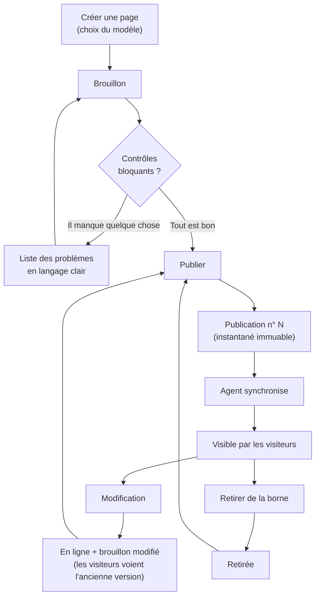

## 13.2 Séparation brouillon / publié — la règle centrale

**Une page possède deux contenus indépendants.** Le brouillon est ce que l'employé modifie ; le publié est ce que le visiteur voit. Rien ne passe de l'un à l'autre sans un clic explicite sur *Publier*.

Cette séparation coûte une colonne en base et une notion à expliquer. Elle apporte en retour :

- la sérénité d'édition sur une page visible en exposition (frustration n°2 de Sylvie, §3.1) ;
- la possibilité d'abandonner des modifications sans conséquence ;
- un retour arrière immédiat, puisque l'ancienne version publiée n'a jamais été écrasée ;
- une réponse claire à « est-ce que c'est en ligne ? » — question posée par tous les personas.

L'interface matérialise cette séparation partout : pastille d'état (§6.6), bandeau dans l'éditeur, libellé du bouton *Publier les modifications (3)*, et un bouton *Abandonner mes modifications* qui restaure le brouillon depuis le contenu publié.

## 13.3 Enregistrement automatique du brouillon

| Événement | Délai | Retour visuel |
|---|---|---|
| Frappe au clavier | — | *Modifications en cours* |
| 800 ms sans frappe | envoi | *Enregistrement…* |
| Réponse du serveur | — | *Brouillon enregistré à 14:32* |
| Échec réseau | 3 réessais (1 s, 3 s, 9 s) | *Échec de l'enregistrement — nouvelle tentative…* puis bandeau d'alerte |
| Échec définitif | — | Bandeau persistant + écriture dans `localStorage` + blocage de la fermeture d'onglet |

Le contenu n'est **jamais** perdu : il existe en trois endroits (mémoire de l'onglet, `localStorage`, serveur). Détail technique en §7.4.3.

## 13.4 Aperçu — la garantie de fidélité

L'aperçu utilise **le composant de rendu de la borne**, alimenté par **le contenu du brouillon**, validé par **le schéma du modèle** (§7.2). Il ne s'agit pas d'une simulation : c'est le même code. Les seules différences avec la borne réelle sont la taille physique de l'écran et le doigt à la place de la souris.

Trois modes d'aperçu, un seul clic pour passer de l'un à l'autre :

| Mode | Usage |
|---|---|
| **Dans l'éditeur** (par défaut) | Le rendu *est* la zone d'édition |
| **Aperçu plein écran** | Sans les enveloppes d'édition, interactif (galerie, vidéo) |
| **Aperçu de la borne entière** | Le sommaire tel qu'il sera, avec la page à sa place dans l'ordre |

## 13.5 Contrôles avant publication

Deux niveaux, jamais confondus.

**Bloquants** — empêchent la publication, car ils produiraient un affichage cassé ou vide devant le public :

| Contrôle | Message affiché |
|---|---|
| Emplacement requis vide | « Il manque l'image principale. » |
| Titre vide | « Il manque le titre de la page. » |
| Média référencé introuvable | « Une photo a été supprimée de la bibliothèque. Remplacez-la. » |
| Vidéo non convertie / illisible | « Cette vidéo n'est pas encore prête. » |
| Dépassement d'une limite de signes | *(impossible : la saisie est bornée en amont)* |

**Conseillés** — affichés, jamais bloquants. L'employé du musée reste maître de son contenu :

| Contrôle | Message |
|---|---|
| Image sans légende | « Sans légende, cette photo ne sera pas décrite aux visiteurs malvoyants. » |
| Image de faible définition | « Cette photo apparaîtra un peu floue sur le grand écran. » |
| Texte très court ou très long | « Un texte de cette longueur se lit difficilement de loin. » |
| Galerie à un seul élément | « Une galerie est plus lisible à partir de 3 photos. » |

**Principe de conception :** on bloque uniquement ce qui casse l'affichage. On ne bloque **jamais** sur un jugement éditorial — le musée sait ce qu'il veut dire, pas l'outil.

## 13.6 Suppression, corbeille, annulation

Trois niveaux de réversibilité, calibrés sur la gravité :

| Action | Réversibilité | Mécanisme |
|---|---|---|
| Réordonner, retirer un média | **10 secondes** | Notification avec bouton *Annuler* |
| Retirer une page de la borne | **Immédiate** | Bouton *Remettre en ligne* |
| Supprimer une page | **30 jours** | Corbeille, avec date d'expiration affichée |
| Supprimer un média utilisé | **Interdit** | La liste des pages concernées est affichée (§11.4) |

Une page **en ligne** ne peut pas être supprimée directement : il faut d'abord la retirer de la borne (§8.4). Ce clic supplémentaire est délibéré.

## 13.7 Rôles et permissions

Deux rôles. Trois auraient été de la complexité gratuite pour une équipe de cinq personnes.

| Action | Éditeur | Administrateur |
|---|---|---|
| Créer, modifier, publier, retirer, supprimer une page | ✅ | ✅ |
| Gérer les médias | ✅ | ✅ |
| Modifier les réglages de la borne | ✅ | ✅ |
| Voir l'état de la borne | ✅ | ✅ |
| Gérer les comptes | ❌ | ✅ |
| Consulter le journal des actions | ❌ | ✅ |
| Déclencher / restaurer une sauvegarde | ❌ | ✅ |
| Restaurer une publication antérieure | ❌ | ✅ |

Les permissions sont vérifiées **côté serveur sur chaque route** ; l'interface se contente de masquer ce qui est inaccessible. Un contrôle uniquement côté client n'est pas un contrôle.

## 13.8 Journal des actions

Toute écriture produit une ligne lisible par un non-technicien :

```
14:31  Sylvie Martin a mis en ligne « Le poste ER-56 »              (publication n°47)
14:02  Sylvie Martin a ajouté 4 photos
11:20  Hélène Dubois a retiré « Ancienne expo » de la borne
09:15  Marc Petit — échec de connexion (3e tentative)
03:00  Sauvegarde automatique réussie (2,4 Go)
```

Le journal est **consultable** (Administrateur) mais jamais modifiable ni supprimable depuis l'interface. Il répond au besoin d'Hélène (§3.3) et sert de premier outil de diagnostic en cas d'incident.

---

# 14. Workflow d'affichage sur la borne

## 14.1 Démarrage

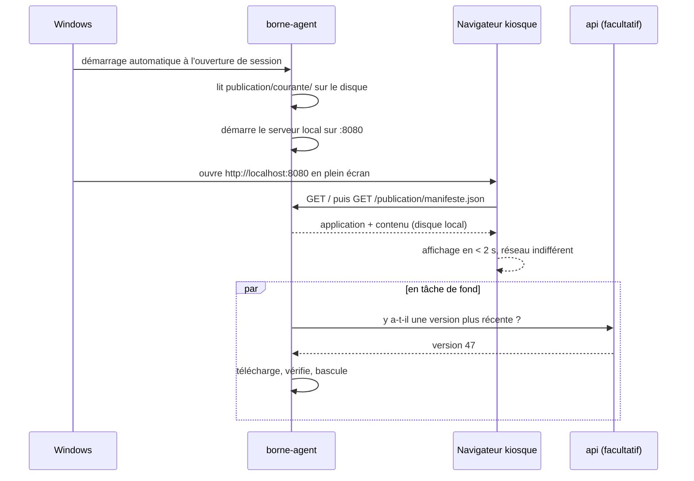

**La borne affiche du contenu avant même d'avoir tenté de joindre le réseau.** C'est la propriété la plus importante de tout le système (critère C4).

## 14.2 Navigation du visiteur

| État | Déclencheur d'entrée | Sortie |
|---|---|---|
| **Veille** | 3 min sans interaction (paramétrable) | Toute interaction |
| **Sommaire** | Sortie de veille, bouton *Sommaire* | Appui sur une page |
| **Page** | Appui sur une vignette, *Précédent* / *Suivant* | Navigation ou veille |
| **Visionneuse** | Appui sur une image | *Fermer*, veille |
| **Lecture vidéo** | Appui sur *Lire* | Fin, *Fermer*, veille |

Règles d'affichage : cibles ≥ 48 px, feedback tactile immédiat, aucune information au survol, `Précédent`/`Suivant` toujours au même endroit, aucun cul-de-sac (tout écran a une sortie visible).

**Réinitialisation à la veille :** retour à l'écran d'accueil, fermeture de toute visionneuse ou vidéo, remise à zéro du défilement. La borne doit se retrouver exactement dans le même état pour chaque nouveau visiteur.

## 14.3 Synchronisation — le détail qui compte

L'agent effectue toutes les 60 secondes :

1. `GET /publication/courante/entete` — une réponse de 60 octets. Si la version est inchangée, tout s'arrête ici (coût réseau négligeable).
2. Sinon : téléchargement du manifeste, puis des **seuls médias absents** du disque (comparaison par empreinte, §7.6).
3. Écriture dans `publication/entrant/`.
4. Vérification : empreinte de chaque fichier, validation du manifeste par le schéma partagé, présence de tous les médias référencés.
5. **Bascule atomique** : `courante` → `precedente`, `entrant` → `courante` (deux renommages de dossier).
6. `POST /borne/etat` pour informer l'administration.

| Incident | Comportement |
|---|---|
| Réseau absent | Réessai à la prochaine minute. Aucun effet visible. |
| Téléchargement interrompu | `entrant/` est conservé, la reprise ne retélécharge que ce qui manque. |
| Empreinte incorrecte | Le fichier est retéléchargé ; après 3 échecs, la synchronisation est abandonnée et signalée. |
| Manifeste invalide | **Bascule refusée.** La borne reste sur la version précédente et l'admin affiche l'alerte. |
| Panne pendant la bascule | Les renommages sont atomiques : au redémarrage, `courante/` est soit l'ancienne, soit la nouvelle, jamais un mélange. |

**Aucun de ces incidents n'est visible par un visiteur.** C'est le cahier des charges de l'agent.

## 14.4 Retour d'état vers l'administration (F36)

| Affichage sur le tableau de bord | Condition |
|---|---|
| ● **La borne est à jour** — dernier contact 14:31 | Version de l'agent = version courante, contact < 5 min |
| ◐ **Mise à jour en cours** — 3 photos sur 12 | Synchronisation en cours |
| ⚠ **Borne injoignable depuis 2 h** | Aucun contact depuis > 15 min |
| ⚠ **La borne affiche une version ancienne (n°45)** | Contact récent mais version en retard |

Le message « injoignable » est accompagné d'une **conduite à tenir** rédigée pour un non-technicien : *« Les visiteurs voient toujours le contenu, mais vos dernières publications ne sont pas encore arrivées. Vérifiez que la borne est allumée et connectée au réseau du musée. »*

## 14.5 Plan B : synchronisation par clé USB

Si le musée ne dispose pas de liaison réseau entre le bureau et la salle d'exposition (hypothèse H3 non vérifiée), le même mécanisme fonctionne sans réseau :

1. Administration → *Paramètres* → **Exporter pour la borne** → produit `publication-047.zip`.
2. Copie sur une clé USB.
3. Sur la borne : brancher la clé ; l'agent détecte l'archive, en vérifie les empreintes et effectue la même bascule atomique.

Le coût de développement est faible (l'agent sait déjà vérifier et basculer ; il ne reste qu'à lire une archive au lieu d'un flux HTTP) et il supprime un risque projet majeur. **Cette fonction est prévue en semaine 3** (§20).

## 14.6 Robustesse en fonctionnement continu

La borne tourne des semaines sans redémarrage. Mesures spécifiques :

- **Aucune fuite** : tout minuteur, animation et écouteur est libéré au démontage (revue systématique, §19.4).
- **Rechargement nocturne** : l'agent recharge la page du navigateur chaque nuit à 4 h. Filet de sécurité à coût nul contre toute dérive lente.
- **Redémarrage automatique** de l'agent en cas d'arrêt inattendu (service système).
- **Contenu invalide ignoré, jamais affiché en erreur** : si une page du manifeste ne passe pas la validation au chargement, elle est retirée du sommaire et l'incident est journalisé — les autres pages restent accessibles. Une page fautive ne fait jamais tomber la borne.
- **Aucune ressource distante** : polices, images, scripts, tout est local. Une seule requête vers l'extérieur suffirait à créer un temps d'attente visible en cas de coupure.

---

# 15. Gestion des médias

## 15.1 Principe : l'utilisateur ne s'occupe de rien

L'employé dépose le fichier tel qu'il sort de l'appareil photo ou du téléphone. **Aucune question ne lui est posée** sur le format, les dimensions, le poids ou la compression. Tout est traité côté serveur.

C'est une réponse directe à la frustration n°3 de Sylvie (§3.1) et la seule approche viable : demander « une image en 1920×1080, moins de 500 ko, en JPEG » à un utilisateur non technique, c'est garantir soit des images inadaptées, soit un appel à l'aide.

## 15.2 Formats acceptés

| Type | Accepté | Refusé, avec explication |
|---|---|---|
| Image | JPEG, PNG, WebP, HEIC/HEIF, TIFF | Fichiers > 50 Mo, largeur < 800 px (alerte, pas blocage), formats vectoriels |
| Vidéo | MP4 (H.264/AAC), WebM (VP9), MOV (H.264) | > 200 Mo, > 30 min, codecs exotiques |

La vérification porte sur la **signature binaire du fichier**, jamais sur son extension (§17.4).

## 15.3 Traitement automatique des images

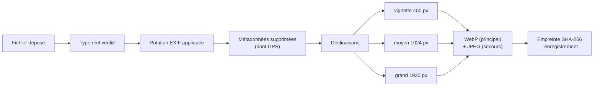

| Profil | Largeur max | Usage |
|---|---|---|
| `vignette` | 400 px | Grille de la bibliothèque, sommaire de la borne |
| `moyen` | 1024 px | Galeries, aperçu de l'éditeur |
| `grand` | 1920 px | Affichage plein écran sur la borne |
| `origine` | conservé | Archive, retraitement futur — **jamais servi à la borne** |

**Décisions notables :**
- La **rotation EXIF** est appliquée physiquement. Sans cela, les photos prises au téléphone s'affichent couchées sur la borne — le défaut le plus fréquent et le plus visible.
- Les **métadonnées sont supprimées**, y compris les coordonnées GPS : gain de poids et hygiène de confidentialité.
- **WebP en principal, JPEG en secours** : ~30 % plus léger à qualité égale, et le navigateur de la borne le gère.
- L'original est **conservé** : si le musée change d'écran en V2, tout peut être régénéré sans redemander les fichiers.
- **Pas de recadrage automatique destructeur.** Le modèle impose un rapport d'affichage ; l'image est cadrée à l'affichage autour de son **point focal** (F16), réglable par un clic sur la miniature. C'est le seul réglage graphique de tout l'outil, et il évite le défaut classique de la tête coupée.

Performance : une photo de 12 Mpx est traitée en 1 à 2 s avec sharp. Le traitement est fait à l'envoi, une fois pour toutes — **jamais à l'affichage** (§18.4).

## 15.4 Vidéos

**Décision : pas de transcodage en V1.** Intégrer FFmpeg signifierait une dépendance lourde, des files d'attente, une supervision de tâches longues et une consommation processeur importante sur la machine du musée — pour un besoin de quelques vidéos par an. Le rejet est motivé en §21.11.

À la place :

1. **Contrôle à l'envoi** : conteneur et codec lus dans l'en-tête du fichier. Si la vidéo n'est pas lisible par le navigateur de la borne, elle est **refusée avec la marche à suivre** (§15.6).
2. **Image de couverture automatique** : extraite dans le navigateur (`<video>` + `<canvas>` à t = 1 s), envoyée comme image liée. Quatre propositions à des instants différents, l'utilisateur choisit. Zéro dépendance serveur.
3. **Durée et dimensions** lues côté client, affichées dans la bibliothèque.
4. **Remplacement facilité** (F14) : bouton *Remplacer* sur l'emplacement et *Remplacer partout* dans la bibliothèque — les pages qui utilisent la vidéo sont mises à jour ensemble, sans avoir à les rouvrir une par une.

## 15.5 Légendes et accessibilité

La légende saisie sert **à la fois** de texte affiché sous le média et d'alternative textuelle (`alt`). Un seul champ, deux usages : l'accessibilité devient une conséquence du travail éditorial normal, et non une case supplémentaire que personne ne remplit.

Une image sans légende déclenche un avertissement **conseillé** au moment de la publication (§13.5) — jamais un blocage.

## 15.6 Messages de refus

Chaque refus indique **ce qui s'est passé** et **quoi faire**, sans jargon :

| Situation | Message |
|---|---|
| Vidéo > 200 Mo | « Cette vidéo pèse 340 Mo, la limite est de 200 Mo. Elle est probablement en très haute définition. Demandez une version "1080p" à la personne qui vous l'a fournie, ou réduisez-la avec VLC (Média → Convertir). » |
| Codec non lisible | « Cette vidéo est dans un format que la borne ne sait pas lire. Convertissez-la en MP4 : voici comment. » (lien vers le guide) |
| Image trop petite | « Cette photo mesure 640 × 480 pixels. Sur l'écran de la borne, elle apparaîtra floue. La garder quand même ? » *(avertissement, pas refus)* |
| Fichier non image | « Ce fichier n'est pas une photo. Formats acceptés : JPEG, PNG, HEIC. » |
| Disque plein | « L'espace de stockage est plein. Prévenez Hélène Dubois. » |

Un guide illustré de deux pages (« Préparer une vidéo pour la borne ») est livré avec le produit (§20, S4).

## 15.7 Cycle de vie et ménage

- **Déduplication** : deux envois du même fichier donnent la même empreinte → un seul fichier stocké, deux entrées de bibliothèque si les noms diffèrent.
- **Suppression protégée** : un média utilisé ne peut pas être supprimé ; la liste des pages concernées est affichée (F23/F24).
- **Filtre « Non utilisés »** dans la bibliothèque, pour faire le ménage sans risque.
- **Purge des orphelins** : les fichiers qui ne sont référencés par aucune publication conservée sont supprimés du disque par une tâche hebdomadaire, avec journalisation.
- **Écriture atomique** : tout fichier est écrit sous un nom temporaire puis renommé. Un envoi interrompu ne laisse jamais de fichier partiel dans la bibliothèque.

---

# 16. Gestion des erreurs

## 16.1 Trois publics, trois traitements

| Public | Ce qu'il reçoit | Ce qu'il ne voit jamais |
|---|---|---|
| **Employé** | Une phrase en français : ce qui s'est passé, quoi faire | Code technique, pile d'appels, nom de table |
| **Développeur** | Journal structuré : identifiant d'incident, pile, contexte | — |
| **Visiteur** | Rien. Jamais. Le contenu valide s'affiche, le reste est ignoré | Toute trace d'erreur |

## 16.2 Format unique de réponse d'erreur

```jsonc
{
  "erreur": {
    "code": "MEDIA_UTILISE",              // stable, exploitable par le client
    "message": "Cette photo est utilisée par 2 pages.",   // affichable tel quel
    "details": [ … ],                     // facultatif, structuré
    "incident": "01J8XQ7…"                // présent uniquement sur erreur inattendue
  }
}
```

Un **seul** gestionnaire d'erreurs Fastify produit ce format (§7.3.3). Aucune route ne contient de `try/catch` : les cas prévus remontent en `Resultat<T, E>`, les cas imprévus remontent en exception et sont capturés en un point unique.

| Famille | HTTP | Exemple de code |
|---|---|---|
| Entrée invalide | 400 | `ENTREE_INVALIDE` |
| Non authentifié | 401 | `SESSION_EXPIREE` |
| Droit insuffisant | 403 | `DROIT_INSUFFISANT` |
| Ressource absente | 404 | `PAGE_INTROUVABLE` |
| Conflit d'état | 409 | `CONFLIT_EDITION`, `MEDIA_UTILISE` |
| Règle métier non satisfaite | 422 | `CONTENU_INCOMPLET` |
| Trop de requêtes | 429 | `TROP_DE_TENTATIVES` |
| Erreur interne | 500 | `ERREUR_INTERNE` + identifiant d'incident |

## 16.3 Erreurs inattendues

Une erreur non prévue produit :
1. une ligne de journal complète (pile, utilisateur, route, corps assaini) avec un **identifiant d'incident** ;
2. une réponse 500 contenant **uniquement** cet identifiant et un message générique ;
3. côté interface : *« Une erreur inattendue s'est produite. Rien n'a été perdu : votre travail est enregistré. Si le problème persiste, communiquez ce numéro : 01J8XQ7… »*

L'identifiant permet de retrouver la trace exacte dans le journal sans jamais exposer d'information technique.

## 16.4 Côté interface

| Portée | Mécanisme | Rendu |
|---|---|---|
| Application entière | Garde-fou React racine | Écran d'erreur avec *Recharger* — l'admin ne devient jamais une page blanche |
| Écran | Garde-fou par route | Le reste de la navigation reste utilisable |
| Requête | État d'erreur TanStack Query | Bandeau dans la zone concernée + *Réessayer* |
| Formulaire | Erreur sous le champ | Message précis, focus placé sur le premier champ fautif |
| Action | Notification | Avec *Annuler* quand l'action est réversible |

**Règle :** une erreur ne fait jamais perdre la saisie en cours. Si la publication échoue, le brouillon reste intact et l'éditeur reste ouvert.

## 16.5 Journalisation

Journaux **structurés JSON** (pino), deux flux distincts :

| Flux | Contenu | Conservation |
|---|---|---|
| **Technique** | Requêtes, durées, erreurs, synchronisations de la borne | 30 jours, rotation quotidienne |
| **Métier** (table `journal`) | Qui a fait quoi, en français, consultable dans l'interface | 2 ans |

```jsonc
{"niveau":"erreur","horodatage":"2026-07-30T12:34:56.789Z",
 "incident":"01J8XQ7…","route":"POST /api/v1/pages/:id/publication",
 "utilisateur":"01J8XA…","duree":45,"message":"SQLITE_BUSY",
 "pile":"…"}
```

**Jamais journalisé :** mots de passe, jetons de session, contenu intégral des médias. Le corps des requêtes est assaini avant écriture.

## 16.6 Défaillances prévues et réponses

| Défaillance | Détection | Réponse |
|---|---|---|
| Base verrouillée | `SQLITE_BUSY` | Réessai automatique (3×, délai croissant) puis 500 |
| Disque plein | Écriture échouée | Refus du téléversement + message clair + alerte sur le tableau de bord |
| Média manquant à l'affichage | Contrôle avant publication | Publication bloquée ; sur la borne, emplacement ignoré, jamais d'image cassée |
| Manifeste corrompu | Validation du schéma à la bascule | Bascule refusée, version précédente conservée |
| Session expirée en pleine saisie | 401 sur l'enregistrement auto | Modale de reconnexion **sans perdre le brouillon**, reprise automatique après connexion |
| Deux personnes éditent la même page | Verrou consultatif + `modifieeLe` | Avertissement, puis 409 avec le nom de la personne |

Le cinquième cas mérite d'être souligné : une session qui expire pendant qu'un employé rédige depuis 40 minutes ne doit **jamais** entraîner la perte du travail. La reconnexion se fait dans une modale, l'enregistrement est rejoué, l'éditeur ne se ferme pas.

---

# 17. Sécurité

## 17.1 Modèle de menace réaliste

L'application est sur le réseau interne d'un musée, avec cinq utilisateurs de confiance. Le modèle de menace n'est ni celui d'une banque, ni celui d'un site public. Les risques réels, par ordre de probabilité :

| # | Risque | Probabilité | Impact | Traitement |
|---|---|---|---|---|
| 1 | Mot de passe faible ou partagé | Élevée | Moyen | Politique de mot de passe, comptes nominatifs, journal |
| 2 | Poste laissé ouvert sans surveillance | Élevée | Moyen | Expiration de session à 8 h, déconnexion explicite |
| 3 | Suppression accidentelle de contenu | Élevée | Élevé | Corbeille, publications immuables, sauvegardes |
| 4 | Envoi d'un fichier malveillant | Moyenne | Élevé | Vérification du type réel, traitement systématique, service non privilégié |
| 5 | Accès depuis le réseau du musée par un tiers | Faible | Élevé | Authentification, HTTPS, limitation de débit |
| 6 | Perte matérielle (disque, vol) | Faible | Élevé | Sauvegardes hors machine |

**Ce contre quoi on ne se protège pas, et pourquoi :** attaquant étatique, déni de service distribué, compromission du réseau interne complet. Se prémunir contre ces scénarios coûterait plus que la valeur protégée. C'est une décision assumée, pas un oubli.

## 17.2 Authentification

- **argon2id** pour les mots de passe (paramètres OWASP : 19 Mio, 2 itérations, parallélisme 1).
- Politique : **12 caractères minimum**, vérification contre une liste de mots de passe courants. Pas d'obligation de caractères spéciaux ni de renouvellement périodique — ces règles produisent des mots de passe notés sur un post-it (recommandation ANSSI et NIST actuelles).
- Comptes **créés par l'Administrateur** : ni inscription libre, ni compte partagé. La traçabilité (§13.8) n'a de sens qu'avec des comptes nominatifs.
- Un compte n'est **jamais supprimé**, seulement désactivé : sinon le journal perdrait ses auteurs.

## 17.3 Sessions

| Élément | Choix | Raison |
|---|---|---|
| Support | Cookie `HttpOnly` `Secure` `SameSite=Strict` | Inaccessible au JavaScript : immunité au vol de jeton par XSS |
| Jeton | 32 octets aléatoires, **stocké haché** (SHA-256) | Une fuite de base ne donne aucune session utilisable |
| Durée | 8 h (une journée de travail), prolongée par l'activité | Compromis usage/risque |
| Révocation | Suppression de la ligne en base | Effet immédiat — impossible avec un JWT autonome (§21.9) |
| CSRF | Jeton par session, en-tête `X-Jeton-CSRF` + `SameSite=Strict` | Double protection |

**Anti-force brute :** 5 échecs → blocage progressif du compte (1 min, 5 min, 15 min), limitation de débit par adresse IP (10 tentatives / 5 min), réponse et temps de réponse identiques que le compte existe ou non.

## 17.4 Téléversements — le point d'entrée le plus sensible

C'est le seul endroit où un utilisateur fait entrer un fichier arbitraire dans le système. Défenses cumulées :

1. **Type réel vérifié par signature binaire**, jamais par extension ni par `Content-Type` déclaré.
2. **Liste blanche** de types autorisés (§15.2).
3. **Taille limitée** au niveau du serveur (Fastify) et du proxy (Caddy) — le flux est coupé avant lecture complète.
4. **Nom de fichier jamais réutilisé** : le fichier stocké est nommé par son empreinte. Traversée de chemin impossible par construction.
5. **Images systématiquement retraitées par sharp** : un fichier polyglotte (image valide contenant du code) ne survit pas au réencodage.
6. **Servis depuis un chemin dédié**, avec `Content-Type` déterminé par le serveur, `X-Content-Type-Options: nosniff` et `Content-Disposition: inline` uniquement pour les types d'affichage.
7. **Aucun fichier n'est exécutable** : le dossier des médias est hors de tout chemin d'exécution, le service tourne sous un compte non privilégié.

## 17.5 Injection

| Vecteur | Protection |
|---|---|
| SQL | Requêtes paramétrées exclusivement (Kysely). Aucune concaténation de chaîne SQL |
| XSS | **Aucun HTML n'est stocké ni rendu** (§7.5.3). React échappe par défaut. `dangerouslySetInnerHTML` est **interdit** par une règle de lint |
| Traversée de chemin | Les chemins de fichiers ne viennent jamais d'une entrée utilisateur (empreintes) |
| Injection dans les journaux | Sérialisation JSON, pas de concaténation |

L'interdiction du HTML utilisateur est la décision de sécurité la plus efficace du projet : elle **supprime la classe de vulnérabilité** au lieu de la filtrer.

## 17.6 En-têtes et exposition

```
Content-Security-Policy: default-src 'self'; img-src 'self' data:;
                         media-src 'self'; script-src 'self'; style-src 'self';
                         object-src 'none'; frame-ancestors 'none'; base-uri 'self'
Strict-Transport-Security: max-age=31536000
X-Content-Type-Options: nosniff
Referrer-Policy: same-origin
Permissions-Policy: geolocation=(), microphone=(), camera=()
```

La politique CSP est **stricte et tenable** parce que l'application ne charge aucune ressource distante (§6.3) : aucune exception à prévoir.

**Décision explicite :** les fichiers médias sont servis sans authentification (§11.4). Ils sont destinés à l'affichage public, leur nom contient une empreinte de 12 caractères non devinable, et la borne doit pouvoir les télécharger avec une clé de service limitée. Protéger ces fichiers apporterait une complexité sans bénéfice réel.

## 17.7 Sauvegardes — la vraie protection

Pour ce projet, la sauvegarde protège contre bien plus de scénarios que n'importe quelle mesure de sécurité réseau.

| | |
|---|---|
| **Quoi** | `donnees.db` (via `VACUUM INTO`, cohérent même pendant une écriture) + dossier des médias + fichier de configuration |
| **Quand** | Chaque nuit à 3 h, et automatiquement avant chaque migration de version |
| **Où** | Disque local (7 dernières) + destination externe définie avec le musée (NAS ou disque USB) |
| **Conservation** | 7 quotidiennes, 4 hebdomadaires, 6 mensuelles |
| **Vérification** | Une restauration de contrôle est effectuée en semaine 4 et documentée. **Une sauvegarde non testée n'est pas une sauvegarde.** |
| **Restauration** | Procédure écrite dans `EXPLOITATION.md`, exécutable par un non-développeur en moins de 15 minutes |

Une sauvegarde manuelle est également téléchargeable depuis les paramètres (F35), pour qu'Hélène puisse en garder une copie avant une opération sensible.

## 17.8 Confidentialité

Aucune donnée personnelle de visiteur n'est collectée : ni compte, ni cookie, ni statistique, ni traceur sur la borne. Les seules données personnelles du système sont celles des cinq comptes employés (nom, identifiant, empreinte de mot de passe, journal d'activité). Les coordonnées GPS des photos sont supprimées à l'envoi (§15.3). Le périmètre RGPD est donc minimal et documenté.

---

# 18. Performances

## 18.1 Objectifs chiffrés

| Contexte | Mesure | Cible | Pourquoi cette cible |
|---|---|---|---|
| Admin | Premier affichage utile | < 1,5 s | Réseau local, aucune excuse |
| Admin | Navigation entre écrans | < 200 ms | Perçue comme instantanée |
| Admin | Frappe dans l'éditeur | < 16 ms par touche | Aucune latence perceptible |
| Admin | Envoi d'une photo de 12 Mpx | < 5 s jusqu'à la vignette | Au-delà, l'utilisateur doute |
| API | Lecture (liste, détail) | < 50 ms (p95) | — |
| API | Publication | < 500 ms | Action ressentie comme un engagement |
| Borne | Démarrage jusqu'à l'affichage | < 2 s | Après une coupure de courant |
| Borne | Ouverture d'une page | < 300 ms | Tout est local |
| Borne | Défilement, animations | 60 images/s constantes | Un à-coup se voit immédiatement sur 65" |
| Borne | Mémoire après 7 jours | Stable (± 10 %) | Détection de fuite (§14.6) |

## 18.2 Ce qui rend l'ensemble rapide, par construction

Les performances ne viennent pas d'optimisations tardives mais de trois décisions d'architecture :

1. **La borne lit des fichiers locaux.** Pas de requête réseau, pas de base de données, pas de rendu serveur. C'est le cas le plus rapide possible, et il est aussi le plus robuste (§7.1).
2. **Les images sont traitées une fois, à l'envoi.** Aucune transformation à l'affichage (§15.3).
3. **Le contenu d'une page est un seul objet JSON.** Une lecture, aucune jointure (§9.4).

## 18.3 Front-end

- **Découpage du code par route** (`React.lazy`) : l'éditeur, la bibliothèque et les paramètres ne sont chargés qu'à l'usage.
- **TanStack Query** : cache mémoire, pas de rechargement au retour sur un écran déjà visité.
- **Virtualisation** de la grille de médias au-delà de 200 éléments et de la liste des pages au-delà de 200 lignes. En dessous, le DOM natif est plus rapide que n'importe quelle virtualisation.
- **Recherche côté client** tant que le volume le permet (< 200 pages) : réponse instantanée, zéro appel réseau.
- **Vignettes en WebP 400 px**, `loading="lazy"`, dimensions déclarées pour éviter tout décalage de mise en page.
- **Budget de taille** : premier chargement < 200 ko compressés hors polices ; vérifié en intégration continue, l'échec du budget fait échouer la construction.

## 18.4 Back-end

- **better-sqlite3 est synchrone** : pas de va-et-vient de promesses, requêtes en dizaines de microsecondes. Sur ce profil de charge, c'est plus rapide qu'un pilote asynchrone.
- **Requêtes préparées** réutilisées.
- **Aucun problème N+1** : les listes sont servies par une requête unique avec agrégation.
- **Traitement d'image en flux**, jamais de chargement complet en mémoire.
- **Fichiers servis avec cache immuable d'un an** — possible parce que le nom contient l'empreinte (§11.7).
- **Compression** (gzip/brotli) sur le JSON et le JavaScript, jamais sur les médias déjà compressés.

## 18.5 Borne

- **Préchargement intelligent** : la page suivante et la précédente du sommaire sont préparées pendant la lecture de la page courante.
- **Images dimensionnées pour l'écran** : le profil `grand` (1920 px) est servi tel quel, sans redimensionnement par le navigateur.
- **Vidéos en lecture directe depuis le disque local**, avec `preload="none"` et image de couverture : aucune consommation tant que le visiteur ne lance pas la lecture.
- **Animations uniquement sur `transform` et `opacity`** : composées par le processeur graphique, 60 images/s garanties.
- **Aucune police distante, aucun script tiers.**

## 18.6 Dimensionnement matériel

| Ressource | Recommandation | Justification |
|---|---|---|
| Serveur | 2 cœurs, 4 Go, 128 Go SSD | Le pic est le traitement d'image (1 à 2 s, ponctuel) |
| Borne | Machine bureautique récente, 8 Go, SSD | Un navigateur, du contenu local |
| Stockage médias | 50 Go | ~1 000 photos + ~30 vidéos, avec marge |
| Réseau | 100 Mbit/s suffisent | La synchronisation transfère quelques centaines de Mo au maximum, en tâche de fond |

Ce dimensionnement est volontairement modeste : le produit doit tourner sur le matériel dont le musée dispose déjà, pas justifier un achat.

## 18.7 Mesure et suivi

- Journalisation de la **durée de chaque requête** ; les requêtes > 200 ms sont marquées et revues.
- Route `/api/v1/sante` : état de la base, espace disque libre, âge de la dernière publication, dernier contact de la borne. C'est le point d'entrée de tout diagnostic.
- Mesure de la **mémoire de la borne sur 7 jours** avant la mise en exposition (§19.5) : c'est le seul test qui détecte une fuite lente.

---

# 19. Plan de tests

## 19.1 Stratégie : tester ce qui coûte cher à casser

Avec 4 semaines et 3 développeurs, viser une couverture élevée partout serait un mauvais placement. On concentre l'effort là où une régression est coûteuse ou invisible :

| Zone | Effort | Pourquoi |
|---|---|---|
| Règles du domaine (états, contrôles, validation) | **Élevé** | Une règle fausse produit une page cassée en exposition |
| Publication et synchronisation | **Élevé** | Le mécanisme le plus critique et le plus difficile à déboguer sur site |
| Traitement des médias | **Moyen** | Beaucoup de cas d'entrée réels (HEIC, EXIF, images énormes) |
| Routes de l'API | **Moyen** | Contrat avec le front, droits d'accès |
| Composants d'interface | **Ciblé** | Uniquement l'éditeur et le téléversement |
| Mise en page, styles | **Manuel** | Le test automatisé visuel coûte plus qu'il ne rapporte ici |

Répartition visée : ~120 tests automatisés, ~25 scénarios manuels documentés. **Aucune cible chiffrée de couverture de code** : elle pousse à tester ce qui est facile plutôt que ce qui est important.

## 19.2 Tests unitaires — domaine (Vitest, sans base ni serveur)

```ts
describe('peutEtreMiseEnLigne', () => {
  it('refuse une page dont un emplacement requis est vide', () => {
    const page = pageDeTest({ modele: 't1', emplacements: { titre: '', … } })
    const r = peutEtreMiseEnLigne(page)
    expect(r.ok).toBe(false)
    expect(r.erreur).toContainEqual(
      expect.objectContaining({ emplacement: 'titre', gravite: 'bloquant' }),
    )
  })

  it('accepte une page complète malgré des avertissements conseillés', () => { … })
})
```

Couvert : transitions d'état (§8.4), contrôles bloquants et conseillés (§13.5), calcul d'ordre en réels (§9.6), validation de chaque modèle avec des contenus limites (0 signe, limite exacte, limite + 1), construction du manifeste, règles de droits (§13.7).

## 19.3 Tests d'intégration — API (`fastify.inject`, SQLite temporaire)

Base réelle recréée à chaque fichier de test, jamais de simulacre : sur SQLite, une base temporaire coûte quelques millisecondes, et l'on teste alors réellement les contraintes, les transactions et les index.

Scénarios couverts :

| # | Scénario | Attendu |
|---|---|---|
| 1 | Connexion, création, brouillon, publication | Publication n°1 créée, page en ligne |
| 2 | Publication d'une page incomplète | 422 avec la liste des problèmes |
| 3 | Suppression d'un média utilisé | 409 avec la liste des pages |
| 4 | Deux `PATCH` concurrents sur le même brouillon | Le second reçoit 409 `CONFLIT_EDITION` |
| 5 | Éditeur appelant une route Administrateur | 403, aucun effet |
| 6 | Envoi d'un `.exe` renommé en `.jpg` | Rejeté par la signature binaire |
| 7 | Réordonnancement puis publication | Ordre respecté dans le manifeste |
| 8 | Retour à une publication antérieure | Manifeste identique à l'original |
| 9 | 6 tentatives de connexion erronées | 429, compte temporairement bloqué |
| 10 | Session expirée pendant un enregistrement | 401, brouillon intact |

## 19.4 Tests de composants (Testing Library) — ciblés

Testés parce que leur défaillance est silencieuse ou coûteuse :

- `useBrouillon` : anti-rebond, réessais, reprise depuis `localStorage`, blocage de fermeture d'onglet ;
- `ChampTexteEnrichi` : limite de signes, collage depuis Word converti en texte simple, gras/italique ;
- `ZoneTeleversement` : file d'attente, refus d'un type non autorisé, message de refus ;
- `ListeTriable` : réordonnancement **au clavier** (`Alt+↑/↓`) — l'exigence d'accessibilité N06 doit être testée, pas espérée ;
- `Modale` : focus piégé, `Échap`, restitution du focus.

**Revue de code systématique** (non automatisable) : tout `setInterval`, `requestAnimationFrame` ou `addEventListener` doit avoir sa libération dans le même bloc. C'est un point de la liste de revue, motivé en §14.6.

## 19.5 Tests de bout en bout — manuels et documentés

Aucun outil d'automatisation de navigateur en V1 : sur 4 semaines, le coût d'écriture et de stabilisation dépasserait le bénéfice, et les parcours critiques doivent de toute façon être vérifiés **sur le matériel réel**, avec un doigt sur une dalle tactile.

Une **fiche de recette** de 25 scénarios est tenue à jour et rejouée avant chaque livraison. Extraits :

| # | Scénario | Critère de réussite |
|---|---|---|
| E1 | Parcours complet de création (§4.1) | < 10 min, sans aide |
| E2 | Correction d'une faute sur page en ligne (§4.2) | < 2 min |
| E3 | Retrait d'urgence (§4.3) | < 60 s |
| E4 | Publication pendant qu'un visiteur consulte | Aucune interruption visible |
| E5 | **Câble réseau débranché, borne redémarrée** | Tout s'affiche, y compris les vidéos |
| E6 | Serveur éteint pendant 24 h | La borne fonctionne normalement |
| E7 | Coupure de courant pendant une synchronisation | Au redémarrage : version cohérente, jamais mixte |
| E8 | Clé USB (plan B, §14.5) | Bascule effectuée et vérifiée |
| E9 | Texte de 5 000 signes collé depuis Word | Tronqué à la limite, aucun style importé, mise en page intacte |
| E10 | Photo verticale prise au téléphone (HEIC, EXIF) | Orientation correcte sur la borne |
| E11 | Vidéo 4K de 340 Mo | Refus avec message exploitable |
| E12 | **Endurance : borne allumée 7 jours** | Mémoire stable, aucun ralentissement |
| E13 | Navigation complète au clavier dans l'admin | Tous les parcours réalisables |
| E14 | Zoom navigateur à 200 % | Aucune perte de fonction |
| E15 | Restauration d'une sauvegarde sur machine vierge | Contenu identique, < 15 min |

**E12 et E15 sont les deux tests que l'on est le plus tenté de sauter, et les deux qui protègent le mieux.** Ils sont inscrits au planning (§20, S4) comme des tâches, pas comme des intentions.

## 19.6 Test d'utilisabilité — le seul juge de C1

En semaine 4, **3 employés du musée** n'ayant jamais vu l'outil réalisent, sans aide et sans documentation :

1. créer et publier une page avec 3 photos ;
2. corriger un texte déjà publié ;
3. retirer une page de la borne.

L'observateur ne parle pas et note : temps, hésitations, erreurs, questions posées à voix haute. **Tout point de blocage rencontré par 2 personnes sur 3 est corrigé avant livraison**, en priorité sur toute autre tâche restante.

C'est le test le plus important du projet : il valide directement l'objectif énoncé au §1.1.

## 19.7 Accessibilité et sécurité

**Accessibilité** — audit manuel des 5 parcours principaux : navigation clavier complète, contrastes vérifiés à l'outil, axe DevTools sans violation critique, lecteur d'écran (NVDA) sur la connexion, la liste et l'éditeur.

**Sécurité** — liste de vérification avant livraison : `npm audit` sans vulnérabilité critique ; en-têtes CSP et sécurité présents ; test manuel des 6 scénarios du §17.1 ; vérification qu'aucun mot de passe ni jeton n'apparaît dans les journaux ; tentative d'accès à une route Administrateur avec un compte Éditeur ; tentative d'envoi de fichier polyglotte.

## 19.8 Intégration continue

À chaque envoi de code : types (`tsc --noEmit`), lint et format (Biome), tests (Vitest), construction des 4 applications, budget de taille du front. **La construction doit toujours passer** — une branche rouge n'est jamais fusionnée.

---

# 20. Planning détaillé sur un mois

## 20.1 Équipe et répartition

| | Rôle | Périmètre principal |
|---|---|---|
| **Dev A** | Serveur | API, domaine, base, sécurité, médias, publication, déploiement |
| **Dev B** | Front administration | Éditeur, liste, bibliothèque, tableau de bord, paramètres |
| **Dev C** | Contenu partagé et borne | `packages/contenu`, `packages/ui`, application borne, agent, recette |

**Pourquoi cette répartition.** Le paquet `contenu` est la dépendance de tout le monde : il est confié à une seule personne, qui le livre **en priorité absolue en semaine 1** afin de débloquer les deux autres. Dev C enchaîne ensuite sur la borne et l'agent — la partie la plus risquée — pendant que A et B produisent l'administration.

## 20.2 Vue d'ensemble

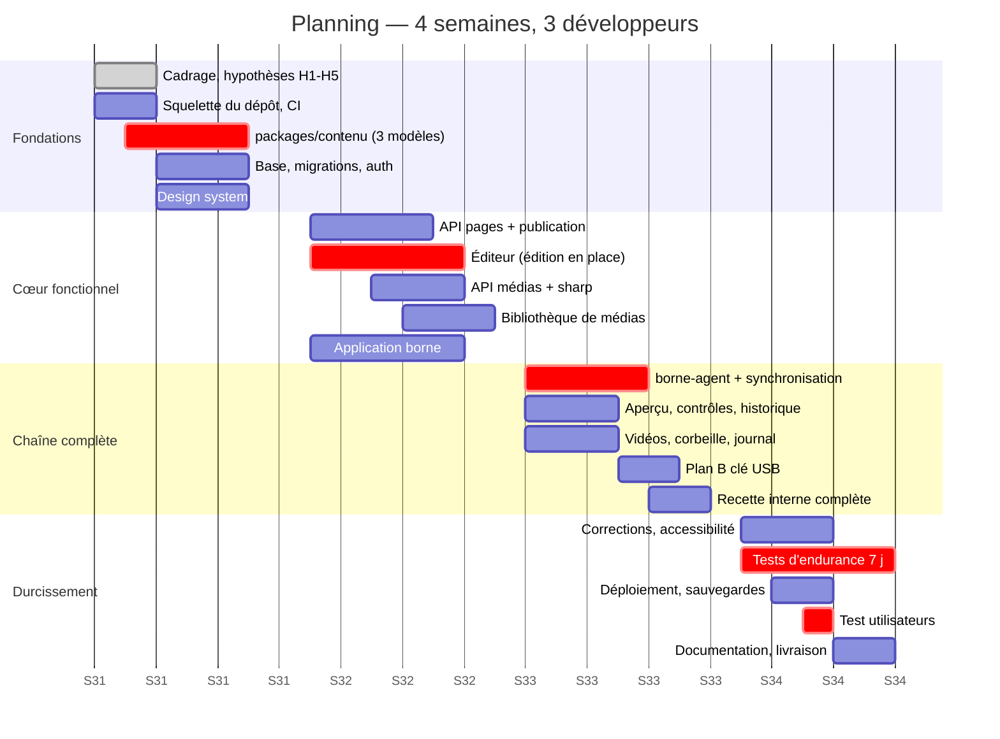

## 20.3 Semaine 1 — Fondations *(3 au 7 août)*

**Objectif : à la fin de la semaine, on peut se connecter, créer une page vide et la voir dans la liste.**

| Dev | Tâches |
|---|---|
| **A** | Squelette du dépôt (espaces npm, TypeScript strict, Biome, CI) · SQLite + migrations + exécuteur · authentification complète (argon2, sessions, CSRF, limitation) · gestionnaire d'erreurs unique · journalisation pino |
| **B** | Design system : variables, `Bouton`, `Champ`, `Modale`, `Pastille`, `Notification`, `EtatVide` · coquille de l'admin (navigation, routes, garde-fous) · écran de connexion · liste des pages (lecture seule) |
| **C** | **`packages/contenu` : déclaration des 3 modèles, dérivation des schémas Zod, composants de rendu, rendu du texte enrichi** · jeu de contenus d'exemple · maquette HTML de la borne validée sur un écran de la bonne taille |

**Jalon J1 (mercredi) — validation avec le musée :** résolution exacte de l'écran, volumétrie, réseau bureau↔borne, comptes et rôles, destination des sauvegardes (hypothèses H1 à H5, §2.5). **Une réponse négative sur H3 déclenche immédiatement le plan B clé USB** (§14.5) — c'est la raison pour laquelle ce jalon est en semaine 1 et non plus tard.

**Livrables :** dépôt fonctionnel, CI verte, connexion opérationnelle, les 3 modèles rendus à l'écran avec du contenu d'exemple, décisions du jalon J1 écrites dans `DECISIONS.md`.

**Dépendance critique :** `packages/contenu` doit être utilisable dès **jeudi**. Tout retard ici décale A et B. C'est le premier point de vigilance du projet.

## 20.4 Semaine 2 — Cœur fonctionnel *(10 au 14 août)*

**Objectif : on peut créer une page complète avec texte, images et galerie, et la publier.**

| Dev | Tâches |
|---|---|
| **A** | API pages (création, brouillon, publication, retrait, réordonnancement, corbeille) · contrôles avant publication · construction du manifeste · API médias : envoi, sharp, déclinaisons, empreintes, index d'usage |
| **B** | **Éditeur** : toile à l'échelle, sélection de bloc, édition en place du titre et du texte, panneau contextuel, compteurs · enregistrement automatique du brouillon (§7.4.3) · emplacements image et galerie, glisser-déposer · sélecteur de médias |
| **C** | Application borne : veille, sommaire, page, visionneuse, navigation tactile, minuteur d'inactivité · lecture d'un manifeste local · vignettes réelles des modèles pour l'écran de création |

**Livrables :** parcours A (§4.1) réalisable de bout en bout en local ; images optimisées automatiquement ; borne affichant un manifeste déposé à la main.

**Risque de la semaine :** l'édition en place (`contenteditable`) est la partie la plus délicate du front. Une journée de marge est réservée le vendredi. Repli identifié : basculer le texte long vers un champ classique dans le panneau de droite, en conservant l'aperçu en direct — dégradation d'ergonomie acceptable, aucun impact fonctionnel.

## 20.5 Semaine 3 — Chaîne complète *(17 au 21 août)*

**Objectif : la chaîne administration → publication → borne fonctionne réellement, hors-ligne compris.**

| Dev | Tâches |
|---|---|
| **A** | Vidéos : contrôles, image de couverture, remplacement partout · corbeille et restauration · journal des actions · comptes et rôles · sauvegarde automatique et export |
| **B** | Aperçu plein écran et aperçu de la borne entière · liste des contrôles avant publication · historique et retour à une version · réordonnancement (souris **et** clavier) · tableau de bord avec l'état de la borne · paramètres |
| **C** | **`borne-agent`** : sondage, téléchargement différentiel, vérification des empreintes, bascule atomique, serveur local, retour d'état · **plan B clé USB** · installation sur le PC réel de la borne |

**Jalon J2 (jeudi) — première publication réelle de bout en bout sur le matériel de la borne.** C'est le jalon le plus important du projet : il valide l'hypothèse d'architecture du §7.1.

**Vendredi : recette interne complète à trois**, fiche de recette §19.5 rejouée entièrement, tous les défauts consignés et classés.

**Livrables :** chaîne complète opérationnelle, tests E5, E6, E7 (hors-ligne, serveur éteint, coupure en pleine synchronisation) passés sur le matériel réel.

## 20.6 Semaine 4 — Durcissement et livraison *(24 au 28 août)*

**Objectif : un produit installé, testé, sauvegardé, documenté, utilisé par le musée.**

| Dev | Tâches |
|---|---|
| **A** | Correction des défauts · durcissement sécurité (liste §19.7) · déploiement final, service système, Caddy · sauvegardes automatiques + **restauration de contrôle réelle (E15)** |
| **B** | Correction des défauts · audit d'accessibilité et corrections (N06) · finition des messages et des états vides · vérification des budgets de performance |
| **C** | **Test d'endurance 7 jours démarré lundi matin (E12)** · guide utilisateur illustré (4 pages) · guide « préparer une vidéo » · `EXPLOITATION.md` · animation du test utilisateurs |

**Mercredi : test d'utilisabilité avec 3 employés du musée** (§19.6). Les corrections issues de ce test sont **prioritaires sur tout le reste** jusqu'à vendredi.

**Vendredi : livraison** — installation en production, formation d'une heure, remise de la documentation, revue des points ouverts et de la feuille de route V2.

**Livrables :** version 1.0.0 installée et utilisée, documentation complète, sauvegarde testée, liste des évolutions V2 priorisée avec le musée.

## 20.7 Dépendances critiques

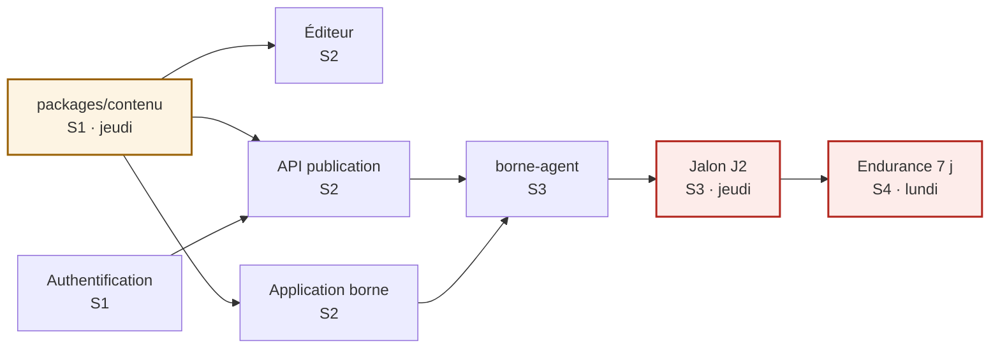

Deux dates ne peuvent pas glisser : **`packages/contenu` jeudi de la semaine 1** (sinon deux personnes attendent) et **le test d'endurance lundi de la semaine 4** (7 jours ne rentrent pas dans une semaine qui commence mercredi).

## 20.8 Registre des risques

| # | Risque | P | I | Prévention | Réaction si survenue |
|---|---|---|---|---|---|
| R1 | Pas de réseau bureau↔borne | Moy | Élevé | Vérifié dès J1 | Plan B clé USB, déjà chiffré et planifié (2 j) |
| R2 | Édition en place plus complexe que prévu | Moy | Moy | Marge le vendredi S2 | Repli sur champ classique + aperçu en direct |
| R3 | Vidéos fournies dans des formats illisibles | **Élevée** | Moy | Contrôles à l'envoi + guide de conversion | Accompagnement du musée ; transcodage repoussé en V2 |
| R4 | Musée indisponible pour J1 ou la recette | Moy | Élevé | Créneaux réservés dès la semaine 0 | Décider sous hypothèse écrite, valider a posteriori |
| R5 | Fuite mémoire détectée tardivement | Faible | **Élevé** | Revue systématique + endurance dès S4 lundi | Rechargement nocturne comme filet (§14.6) |
| R6 | Matériel de la borne indisponible avant S3 | Moy | Élevé | Réservé dès S1 | Test sur écran équivalent, revérification à la livraison |
| R7 | Périmètre qui s'élargit en cours de route | **Élevée** | Élevé | Périmètre écrit et signé (§1.5) | Ordre de retrait ci-dessous, décidé à l'avance |
| R8 | Absence d'un développeur (maladie, congés) | Moy | Élevé | Revue croisée, aucun domaine sans second lecteur | Retrait par l'ordre ci-dessous |

## 20.9 Ordre de retrait décidé à l'avance

Si le planning se tend, on retire **dans cet ordre**, sans rouvrir de discussion :

1. Historique et retour à une version antérieure (F07) — la sauvegarde couvre le cas grave ;
2. Duplication de page (F06) ;
3. Recherche de pages (F08) — inutile en dessous de 30 pages ;
4. Filtre « non utilisés » et purge des orphelins ;
5. Journal des actions dans l'interface (F34) — les journaux techniques restent disponibles ;
6. Point focal des images (F16) — recadrage centré par défaut.

**Ce qui ne sera jamais retiré** : la séparation brouillon/publié, l'aperçu fidèle, le fonctionnement hors-ligne de la borne, les sauvegardes, la corbeille. Ce sont les fondations de la confiance des utilisateurs — les retirer produirait un outil que personne n'oserait employer.

## 20.10 Rituels

Réunion debout de 15 min chaque matin ; démonstration de 30 min chaque vendredi (avec le musée dès la semaine 2) ; revue de code obligatoire, aucune fusion sans relecture ; `DECISIONS.md` mis à jour à chaque arbitrage — c'est ce document qui permettra, dans un an, de comprendre pourquoi telle chose a été faite ainsi.

---

# 21. Choix techniques justifiés

## 21.1 Méthode

Chaque choix a été confronté à quatre critères, dans cet ordre :

1. **Adéquation au besoin réel** (pas au besoin imaginé) ;
2. **Coût d'apprentissage et de mise en œuvre** sur 4 semaines ;
3. **Coût de maintenance** par une équipe qui n'existe peut-être plus dans un an ;
4. **Réversibilité** en cas d'erreur de jugement.

La popularité n'est pas un critère. Elle n'intervient qu'indirectement, via la disponibilité de la documentation.

## 21.2 TypeScript strict, partout

**Retenu.** Un seul langage du serveur à la borne, et surtout : les types du modèle de contenu sont **partagés** entre les trois applications (§7.2). Une modification de modèle produit une erreur de compilation partout où elle doit être répercutée — c'est le filet de sécurité le plus rentable du projet.

*Écarté :* JavaScript seul (perd le bénéfice principal du projet), Python ou Go côté serveur (deuxième langage, types du contenu à dupliquer, donc à désynchroniser).

## 21.3 React 19

**Retenu.** Écosystème le plus documenté, réservoir de compétences le plus large en France pour la reprise, et surtout : `packages/contenu` peut exporter des **composants** partagés entre l'admin et la borne — c'est ce qui rend l'aperçu structurellement fidèle.

*Écartés :* **Vue / Svelte** — techniquement excellents, mais rien ne justifie ici le pari sur une reprise de projet plus difficile. **HTMX / rendu serveur classique** — l'éditeur est une application riche avec état local complexe et enregistrement automatique ; le faire sans framework client coûterait plus cher. **Web Components natifs** — outillage et documentation en retrait, aucun gain.

## 21.4 Vite, et non un méta-framework

**Retenu.** Démarrage instantané, configuration quasi nulle, production de fichiers statiques que n'importe quel serveur peut servir.

*Écarté :* **Next.js / Remix.** L'administration est une application derrière authentification : ni référencement, ni rendu serveur nécessaires. Un méta-framework apporterait un serveur supplémentaire à déployer et à maintenir, un modèle de rendu à maîtriser, et des choix de déploiement orientés vers l'hébergement en nuage — l'inverse du besoin d'un musée qui héberge chez lui. **C'est de la complexité importée sans contrepartie.**

## 21.5 TanStack Query, pas de magasin d'état global

**Retenu** pour l'état serveur : cache, revalidation, réessais, états de chargement et d'erreur — soit la majorité du code d'état d'une application d'administration, écrit une fois pour toutes par d'autres.

*Écartés :* **Redux (+ Toolkit)** — beaucoup de cérémonie pour un problème que l'on n'a pas ; une fois l'état serveur pris en charge, il reste deux contextes. **Zustand / Jotai** — plus légers, mais toujours superflus. **Rien du tout** — signifierait réécrire à la main cache et réessais, c'est-à-dire réintroduire les bogues que TanStack Query a déjà corrigés.

## 21.6 CSS Modules et variables CSS

**Retenu.** Zéro dépendance, zéro configuration, portée locale garantie, lisible par n'importe quel développeur web. Les variables du design system sont partagées par l'admin et la borne, avec des valeurs différentes pour les deux échelles typographiques (§6.3).

*Écartés :*
- **Tailwind** — remplace la question « quelle valeur ? » par « quelle classe ? », ce qui n'aide pas ici, et rend le HTML des composants de rendu partagés nettement moins lisible. Sur un projet à 3 développeurs avec un design system de 14 composants, le gain de vitesse ne compense pas la dépendance et la configuration.
- **MUI / Ant Design / Chakra** — apportent 200 composants dont on en utilise 14, un poids important, et surtout **une identité visuelle qui n'est pas celle du musée**. Les personnaliser coûte plus cher que d'écrire les 14 composants voulus.
- **CSS-in-JS (styled-components, Emotion)** — coût à l'exécution, complexité de configuration, tendance de fond à l'abandon.

## 21.7 Pas d'éditeur de texte riche

**Décision structurante :** trois marquages (gras, italique, liste), un format textuel simple, un rendu partagé d'une quarantaine de lignes (§7.5.3).

*Écartés :* **TipTap, Lexical, Slate, Quill.** Ce sont d'excellentes bibliothèques, mais elles résolvent un problème que nous ne voulons pas avoir. Adopter l'une d'elles signifierait : stocker du HTML ou un arbre riche, donc devoir l'assainir (surface XSS) ; permettre des structures que les modèles ne prévoient pas, donc rouvrir la possibilité de casser la mise en page ; ajouter 100 à 300 ko et une API conséquente à maîtriser ; gérer le collage depuis Word et ses styles. **Le sous-ensemble minimal supprime ces quatre problèmes d'un coup**, et couvre tous les besoins éditoriaux exprimés.

## 21.8 Fastify

**Retenu.** Validation de schéma intégrée, journalisation pino intégrée, gestion d'erreurs centralisée, greffons officiels pour les fichiers statiques, l'envoi de fichiers, les cookies, la limitation de débit et les en-têtes de sécurité. **Trois exigences du cahier des charges (validation, journalisation, gestion d'erreurs) sont couvertes par le socle**, sans code à écrire.

*Écartés :* **Express** — plus connu, mais nécessite d'assembler soi-même validation, journalisation et gestion d'erreurs ; son écosystème d'intergiciels vieillit. **NestJS** — architecture en couches et injection de dépendances fournies, mais au prix d'un cadre lourd, de décorateurs, de modules, et d'une courbe d'apprentissage réelle : disproportionné pour ~35 routes. **Node natif sans cadre** — tentant pour la sobriété, mais il faudrait réécrire l'analyse des envois multipart et la validation, avec plus de risque et moins de sûreté.

## 21.9 Sessions par cookie, pas de JWT

**Retenu.** Cookie `HttpOnly` + jeton haché en base (§17.3).

*Écarté :* **JWT autonome.** Son seul avantage réel — ne pas consulter la base — n'a aucune valeur ici : nous consultons SQLite en quelques microsecondes. En revanche, il apporte un défaut majeur : **on ne peut pas révoquer un jeton émis**. Désactiver un compte n'aurait aucun effet jusqu'à l'expiration. Le stocker côté client expose au vol par XSS ; le stocker en cookie `HttpOnly` revient à faire une session, en plus compliqué.

*Écartés :* **Auth0, Clerk, Keycloak.** Un service externe pour cinq comptes internes, sur une installation qui doit fonctionner sans internet, serait à la fois plus cher, plus fragile et contradictoire avec la contrainte d'autonomie.

## 21.10 Pas de conteneurisation en V1

**Retenu :** un service système (systemd ou NSSM), Node LTS, un fichier de configuration.

*Écarté :* **Docker.** Sur une machine dédiée à un seul service, il n'apporte ici ni isolation utile, ni portabilité utile — mais il ajoute une couche que le musée devra comprendre pour toute opération de maintenance : où sont les volumes, comment lire les journaux, comment mettre à jour l'image. **On déplacerait la complexité vers la personne la moins équipée pour l'absorber.** *(Kubernetes ou l'orchestration en nuage ne sont pas discutés : ils sont sans rapport avec le besoin.)*

Cette décision est **réversible** : le produit est un simple processus Node avec un fichier SQLite et un dossier de médias — l'empaqueter en conteneur plus tard, si le musée se dote d'une infrastructure, prendrait une heure.

## 21.11 Pas de transcodage vidéo

**Retenu :** contrôle du format à l'envoi, refus explicite avec marche à suivre, image de couverture extraite dans le navigateur (§15.4).

*Écarté :* **FFmpeg côté serveur.** Il faudrait une file de tâches, une supervision des traitements longs, une gestion des échecs, une consommation processeur importante, et une interface qui explique qu'une vidéo « est en cours de préparation ». Pour quelques vidéos par an, c'est un mauvais placement : mieux vaut un guide de deux pages expliquant comment exporter en MP4 1080p. Inscrit en V2 (§22) si l'usage réel le justifie.

## 21.12 SQLite

Justifié en détail au §9.1. En résumé : le seul avantage de PostgreSQL — la concurrence en écriture — ne correspond à aucun besoin, tandis que « la sauvegarde est une copie de fichier » est une propriété de robustesse décisive pour une structure sans service informatique.

*Écartés :* **PostgreSQL / MySQL** (serveur à administrer), **MongoDB** (le modèle est relationnel : pages, médias, usages, comptes), **fichiers JSON seuls** (ni transactions, ni intégrité référentielle ; l'index d'usage des médias deviendrait incohérent à la première interruption).

## 21.13 Aucun CMS existant

**Écartés :** **WordPress** (surface d'attaque et charge de mise à jour considérables, greffons, et rien n'empêche de casser la mise en page) ; **Strapi / Directus / Payload** (excellents pour livrer une API de contenu générique, mais l'essentiel de notre valeur est précisément dans ce qu'ils ne font pas : l'édition en place dans un aperçu fidèle, les contrôles avant publication, la publication atomique versionnée, la synchronisation hors-ligne d'une borne. Nous passerions le mois à contourner leur interface d'administration générique) ; **Contentful, Sanity et autres services en nuage** (contradictoires avec la contrainte hors-ligne, et abonnement récurrent pour un musée).

**Le point décisif :** un CMS générique donne un panneau d'administration générique. Notre exigence n°1 est qu'un agent d'accueil retrouve son chemin après quatre mois sans usage. Cela ne s'obtient pas en configurant un outil générique.

## 21.14 npm workspaces

**Retenu.** Intégré à npm : aucun outil supplémentaire à installer, comprendre ou maintenir. Suffisant pour 4 applications et 2 paquets.

*Écartés :* **Nx, Turborepo** (cache distribué et graphe de tâches : sans objet à cette échelle), **pnpm** (bon outil, mais imposer un gestionnaire de paquets supplémentaire à l'installation chez le musée n'apporte rien ici), **dépôts séparés** (les types partagés devraient être publiés ou copiés — la duplication finirait par diverger, exactement ce que l'architecture cherche à empêcher).

## 21.15 Vitest et Biome

**Vitest retenu** : même moteur que Vite, un seul exécuteur pour le serveur, le front et les paquets partagés, rapide. *Écartés :* Jest (configuration plus lourde avec Vite et ESM), Playwright/Cypress (§19.5 : coût supérieur au bénéfice sur 4 semaines).

**Biome retenu** : lint et formatage en un seul outil, quasi sans configuration, très rapide. *Écarté :* ESLint + Prettier — combinaison standard, mais deux outils, deux configurations et des conflits classiques à arbitrer ; le temps ainsi économisé se compte en heures sur un mois.

## 21.16 Inventaire complet des dépendances

Chaque ligne répond à une exigence nommée. **Aucune dépendance « de confort ».**

| Dépendance | Emplacement | Exigence couverte |
|---|---|---|
| `react`, `react-dom` | admin, borne, contenu | Interface et composants de rendu partagés |
| `react-router` | admin | Navigation |
| `@tanstack/react-query` | admin | État serveur (§21.5) |
| `@dnd-kit/core` | admin | Glisser-déposer **accessible au clavier** (N06) |
| `zod` | partout | Validation unique front/serveur/borne (N08) |
| `fastify` + greffons officiels | api | Serveur, envois, statiques, cookies, limitation, en-têtes |
| `better-sqlite3` | api | Base (§9.1) |
| `kysely` | api | Requêtes SQL typées, sans ORM |
| `sharp` | api | Optimisation des images (F21) |
| `@node-rs/argon2` | api | Empreintes de mots de passe (§17.2) |
| `pino` *(via Fastify)* | api | Journalisation structurée (N09) |
| `vite`, `typescript`, `vitest`, `biome` | développement | Construction, types, tests, qualité |

**Total : 12 dépendances d'exécution.** C'est peu, et c'est délibéré : chaque dépendance est une mise à jour à suivre, une faille potentielle et une chose de plus à comprendre pour celui qui reprendra le projet.

## 21.17 Ce que nous avons délibérément choisi de ne pas faire

| Non-choix | Raison |
|---|---|
| Rendu serveur, référencement | Application privée derrière authentification |
| Temps réel (WebSocket) | Le sondage toutes les 60 s suffit ; un verrou consultatif remplace la présence en direct |
| Micro-services | Un domaine, une équipe, une machine |
| GraphQL | ~35 routes stables, un seul client ; REST est plus simple à déboguer |
| Internationalisation | Un musée, une langue. Prévu V2, non payé aujourd'hui |
| Mode sombre | Aucun besoin exprimé, doublerait le travail de design |
| Application mobile | La borne est fixe, l'admin s'utilise sur ordinateur |
| Télémétrie, statistiques | Aucun besoin exprimé, et des questions de vie privée pour rien |

---

# 22. Évolutions possibles (V2)

Classées par rapport valeur/coût, telle qu'elle sera discutée avec le musée à la livraison. **Toutes sont réalisables sans remettre en cause l'architecture** — c'est le principal critère qui a guidé les choix du §21.

## 22.1 À forte valeur, coût faible

| Évolution | Description | Effort | Pourquoi c'est facile |
|---|---|---|---|
| **Planification de publication** | « Mettre en ligne le 15 septembre à 9 h » | 3 j | Une date sur la publication, une tâche périodique |
| **4ᵉ et 5ᵉ modèles** | Frise chronologique, comparatif avant/après | 4 j / modèle | Un fichier de déclaration + un composant de rendu (§7.5.1) |
| **Modèles de page pré-remplis** | « Nouvelle acquisition », « Exposition temporaire » avec structure et conseils | 2 j | Contenu initial à la création |
| **Aperçu sur téléphone** | Vérifier une page depuis la salle, avant validation | 2 j | L'admin est déjà une application web |
| **Import groupé de photos** | Déposer un dossier entier dans la bibliothèque | 2 j | L'envoi multiple existe déjà |

## 22.2 Valeur moyenne, coût moyen

| Évolution | Description | Effort |
|---|---|---|
| **Multi-langue (FR / EN)** | Contenu traduisible, bouton de langue sur la borne | 10 j — champs par langue, sélecteur, repli sur le français |
| **Validation à deux niveaux** | Un éditeur propose, un responsable approuve | 5 j — un état supplémentaire (§8.4) et une notification |
| **Statistiques de consultation** | Pages les plus vues, durée moyenne, heures de forte affluence | 6 j — compteurs locaux sur la borne, remontés à la synchronisation. Aucune donnée personnelle |
| **Transcodage vidéo** | Accepter tous les formats et convertir automatiquement | 8 j — FFmpeg + file de tâches (§21.11) |
| **Recherche sur la borne** | Clavier tactile, recherche dans les titres et les textes | 5 j |
| **Gestion de plusieurs bornes** | Plusieurs bornes, contenus communs ou distincts | 10 j — l'agent et le modèle de publication sont déjà conçus pour ; il faut une notion de groupe |

## 22.3 Valeur conditionnelle, à n'engager que sur besoin avéré

| Évolution | Condition d'engagement |
|---|---|
| **Éditeur de modèles** | Seulement si le musée demande plus de 6 modèles. En dessous, développer un modèle coûte moins cher que maintenir un éditeur de modèles — **et l'éditeur rouvrirait la porte à la mise en page cassée**, ce qui contredit la vision (§1.2) |
| **Contenus interactifs** (quiz, carte cliquable) | Demande pédagogique explicite ; chacun est un modèle spécifique |
| **Intégration au catalogue des collections** | Existence d'une base de collections avec une API |
| **Accès distant hors du musée** | Besoin réel de télétravail ; implique VPN ou publication sur internet, donc un durcissement de sécurité substantiel |

## 22.4 Dette technique assumée et son traitement

| Point | Nature | Quand le traiter |
|---|---|---|
| Pas de tests automatisés de bout en bout | Assumé (§19.5) | Si l'équipe devient pérenne : Playwright sur 5 parcours |
| Verrou d'édition consultatif | Assumé (§7.4.3) | Si les conflits deviennent fréquents (peu probable à 5 utilisateurs) |
| Vidéos non transcodées | Assumé (§21.11) | Si le musée produit régulièrement des vidéos |
| SQLite mono-écrivain | Limite théorique | Trois ordres de grandeur au-dessus du besoin ; les dépôts sont des ports, la bascule vers PostgreSQL est locale à `infrastructure/` |
| Pas de conteneurisation | Assumé (§21.10) | Si le musée se dote d'une infrastructure gérée |
| Recherche côté client | Limite à ~200 pages | Passage à une recherche serveur (FTS5 de SQLite, natif) : 2 j |

## 22.5 Ce qu'il ne faut pas faire, même si on le demande

| Demande probable | Pourquoi refuser | Alternative à proposer |
|---|---|---|
| « Pouvoir déplacer les blocs librement » | Détruit la garantie qui fait la valeur du produit (§1.2). Six mois plus tard, les pages seraient hétérogènes et le musée redemanderait de la cohérence | Créer un modèle supplémentaire correspondant au besoin réel |
| « Coller directement depuis Word en gardant la mise en forme » | Réintroduit du HTML arbitraire : failles, incohérence graphique, rupture de gabarit | Collage converti en texte simple, gras et italique conservés |
| « Un champ HTML libre pour les cas particuliers » | Une seule exception suffit à annuler toutes les garanties du système | Identifier le cas réel et en faire un emplacement typé |
| « Que la borne aille chercher le contenu en direct » | Détruit la propriété la plus importante du système : le fonctionnement hors-ligne (§7.1) | Réduire l'intervalle de synchronisation ; 60 s peuvent devenir 15 s |

---

## Conclusion

Ce document décrit un produit **délibérément petit**, dont chaque contrainte est un choix.

Les cinq décisions qui portent l'ensemble :

1. **Des modèles fermés à emplacements typés** — la mise en page ne peut pas être cassée parce qu'elle n'est pas modifiable (§7.5).
2. **Un paquet de contenu partagé par les trois applications** — l'aperçu n'est pas fidèle par soin, il l'est par construction (§7.2).
3. **Une borne qui lit des fichiers locaux** — elle fonctionne serveur éteint, réseau coupé, par architecture et non par précaution (§7.1).
4. **Des publications immuables et numérotées** — atomicité, retour arrière, historique et synchronisation résolus par une seule notion (§7.6).
5. **Aucun HTML utilisateur** — une classe entière de failles et d'incohérences supprimée plutôt que filtrée (§7.5.3).

Le reste — le choix du cadre serveur, du moteur de base, de l'outil de test — est important mais secondaire, et surtout **réversible**. Ces cinq décisions-là ne le sont pas : ce sont elles qu'il faut défendre pendant les quatre semaines, et c'est à leur aune qu'il faudra juger toute demande d'évolution.

Le critère de réussite n'est ni la richesse fonctionnelle, ni l'élégance technique. C'est qu'un agent d'accueil, quatre mois après la dernière fois, retrouve son chemin seul et corrige une erreur en deux minutes — sans avoir peur de casser quelque chose.
